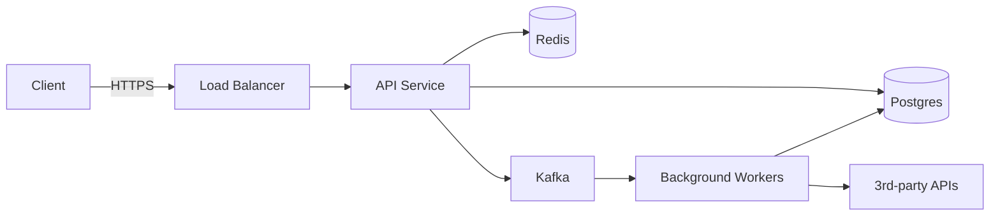

# Developer Handoff Kit

> A handoff isn't a meeting; it's a SET OF ARTIFACTS that survives
> the original team's attention. Done right, the recipient never needs
> to schedule a sync to start working.

## The kit's directory layout

```
handoff/
├── README.md                    Start here. Time-to-productive: 1 day.
├── 01-overview.md               What this system does + why it exists
├── 02-architecture.md           System diagram + key decisions (ADR-style)
├── 03-quickstart.md             Clone → run → produce visible output in <15 min
├── 04-integration-guide.md      How OUR system fits with theirs / theirs with ours
├── 05-api-reference/            Generated from OpenAPI / language SDK docs
├── 06-runbook.md                Common operations + when to page whom
├── 07-known-issues.md           What's flaky, why, and the workaround
├── 08-roadmap.md                What's coming + when (last 90 / next 90 days)
├── 09-contacts.md               Named humans for each system area
└── examples/                    Runnable code samples by use case
    ├── 01-hello-world/
    ├── 02-common-flow/
    └── 03-advanced-pattern/
```

## README.md — the time-to-productive contract

```markdown
# Welcome to <System Name>

You can be productive on this codebase in 1 working day. Here's the path:

## First 30 minutes — orient
1. Read `01-overview.md` (5 min)
2. Skim `02-architecture.md` (10 min — look at the diagram)
3. Glance at `09-contacts.md` so you know who to ask

## Next 60 minutes — run it
4. Follow `03-quickstart.md` end to end. You should have the service
   running locally + serving a real request.

## Next 2 hours — make a change
5. Pick a "good first issue" labeled in our tracker (link in `09-contacts.md`).
6. Open the matching example in `examples/02-common-flow/`.
7. Make the change. Run the tests. Ship a PR.

## By end of day 1
You should have:
- ✅ Service running locally
- ✅ One PR open with a small change + tests
- ✅ Slack thread with reviewer engaged
- ✅ Read at least `06-runbook.md` cover-to-cover

If you can't, file a bug on this handoff kit — that's a failure of
documentation, not of you.
```

## 02-architecture.md — the diagram that matters

The architecture doc anchors on ONE diagram (rendered, not described).
Use Mermaid so it lives next to the code:



Then 5-10 bullets explaining the key constraints/decisions ("Postgres
chosen over MongoDB because…" → link to ADR).

## 03-quickstart.md — the 15-minute promise

Three sections:

```markdown
## Prereqs (under 30 seconds to check)
- macOS or Linux. Windows: use WSL2.
- Docker 24+
- Python 3.12 (`brew install python@3.12`)
- Make

## Run it (under 15 minutes)
```bash
git clone git@github.com:our-org/service.git
cd service
make setup           # creates venv, installs deps
make compose-up      # postgres + redis + service in docker
curl http://localhost:8000/healthz
# {"status":"ok"}
```

## Make a request that does something visible
```bash
curl -X POST http://localhost:8000/v1/things \
  -H "Authorization: Bearer dev-token" \
  -H "Content-Type: application/json" \
  -d '{"name":"hello"}'
```
You should see the new "thing" in the response. Now look in the DB:
```bash
make psql -- -c "SELECT * FROM things"
```
```

If any step takes longer than expected, that's the first bug to file.

## 04-integration-guide.md — for external consumers

Tailored when this is an SDK / API being given to outside teams:

- Authentication setup (sandbox token + how to get prod)
- One-page integration overview (your code → their code)
- Per-language client snippets (Python, TypeScript at minimum)
- Common pitfalls + their fix
- Test environment isolation pattern

## 06-runbook.md — production survival

For each known scenario:

```markdown
### Symptom: 5xx rate above 1% sustained

**Detection**: alerted by `api_error_rate_high` in PagerDuty.

**First response (under 5 min)**:
1. Check status page of <upstream dependency X>: <URL>
2. Look at the most recent deploy: `kubectl rollout history deploy/api`
3. If a deploy in the last 30 min: roll back.
   `kubectl rollout undo deploy/api`

**Diagnosis**:
- Logs: `https://logs.example.com/api?last=30m`
- Traces: `https://traces.example.com/api?last=30m&min_duration=1s`

**Escalation**:
- 15 min unresolved → page secondary on-call
- 30 min unresolved → page EM + product on-call
- 1h unresolved → start incident command (see incident_command_system skill)
```

## 07-known-issues.md — radical honesty

```markdown
### test_payments_flow is flaky
**Impact**: ~3% of CI runs fail spuriously.
**Workaround**: re-run; if 3 consecutive fails, file an issue.
**Root cause**: timing-dependent assertion; pending fix in #1234.

### Redis sometimes returns stale data on cache warm-up
**Impact**: first request after a deploy may see 30s of stale data.
**Workaround**: pre-warm cache in deploy hook (already automated).
**Tracking**: #5678
```

If you hide known issues from a new owner, they discover them as
incidents — at 2am, with no context.

## 09-contacts.md — the named humans

```markdown
| System area | Owner | Backup | Slack |
|---|---|---|---|
| Payment processing | @alice | @bob | #payments-on-call |
| Auth + sessions | @carol | @dan | #auth |
| Database / migrations | @eve | @frank | #data |
| Build / deploy | @grace | @hal | #platform |
| **Generalist for anything else** | @ivy | @jim | #service-help |
```

## Anti-patterns

- **Handoff = a 2-hour meeting + a shared Google Doc.** Two months
  later, nobody can find the doc or remembers the meeting.
- **Architecture diagram on a slide deck** — out of date in 4 weeks
  because nobody can edit slides. Use Mermaid (rendered from code).
- **"Examples/" with stale code** — kit fails Day-1 because the
  examples haven't been updated since the last refactor. Wire the
  examples into CI; they must pass on every commit.
- **No named owners** — "ask in #engineering." That's a polite "good
  luck."
- **Quickstart that takes 4 hours** because of a manual step on
  someone's laptop. Automate the env setup; if you can't, that's the
  first thing to fix.

## Validation that the kit works

- A volunteer (not the original team) follows the README on Day 1.
- They report what didn't work; you fix it.
- A second volunteer goes through and reports < 2 papercuts.
- Now the kit is shippable. Until then, it's a draft.
