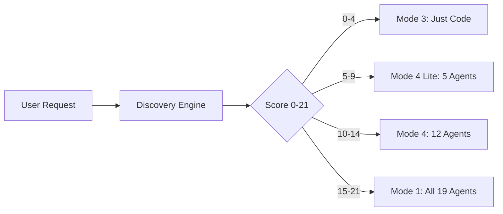

<p align="center">
  
</p>

<h1 align="center">🤖 Kiro Automation Orchestrator</h1>

<p align="center">
  <strong>Stop deploying 19 AI agents for a calculator.</strong><br/>
  A meta-framework that right-sizes AI development effort to project complexity.
</p>

<p align="center">
  
  
  
  
  
</p>

<p align="center">
  
  
  
  
  
</p>

<p align="center">
  
  
  
  
  
</p>

<p align="center">
  
</p>

---

## 🎯 The Problem

AI coding assistants have a universal problem: **they don't know when to go deep and when to keep it simple.**

- Ask for a "calculator" → get microservices architecture, cloud deployment, 19-agent pipeline → **OVERKILL**
- Ask for a "fintech platform" → get a single file with no security review → **UNDERKILL**

## 💡 The Solution

This orchestrator **automatically right-sizes** the AI response based on project complexity scoring.

---

## 🏗️ Five Core Features

### 1. 🔍 Discovery Engine
> 7 scoping questions → complexity score (0–21) → automatic mode selection

| Score | Tier | Mode | Example |
|-------|------|------|---------|
| 0–4 | Minimal | Mode 3 (Direct) | Calculator, script |
| 5–9 | Light | Mode 4 Lite | Task manager, CRUD app |
| 10–14 | Standard | Mode 4 / Mode 1 Lite | SaaS MVP, mobile app |
| 15–21 | Full | Mode 1 (Full Army) | Fintech platform, enterprise |

### 2. 🎛️ 4 Execution Modes

| Mode | Name | Description |
|------|------|-------------|
| 1 | **Full Army** | All 19 roles, multi-phase, gates, 8+ docs/phase |
| 2 | **Single Agent** | One expert, one deliverable |
| 3 | **Direct Execution** | Just code it, no overhead |
| 4 | **Hybrid** | Spec planning → army execution |

### 3. 👥 19 Agent Roles

```
Market Researcher → CTO → Product Manager → Architect → DB Architect →
Cloud Architect → FinOps → Security Engineer → Scrum Master →
Backend Lead → Frontend Lead → Sr. Backend Engineer → Sr. Frontend Engineer →
ML Engineer → QA Engineer → DevOps Engineer → SRE → Technical Writer →
Website Creator
```

Each role has a `SKILL.md` template. Fires only when Discovery Engine activates it.

### 4. ⚡ Context & Token Discipline

- **Caveman Ultra Mode** — terse output, zero filler
- **2-Read Rule** — max 2 source file reads per task
- **Budget Tiers** — PEAK → GOOD → DEGRADING → CRITICAL (auto-degrades)
- **60%+ token savings** vs naive approach
- **Self-monitoring** — context rot detection, automatic archival

### 5. 🧠 Cross-Session Memory

- **agentmemory MCP** — local, hybrid BM25+vector search
- **Auto-retrieval hook** — queries memory at session start
- **Checkpoint system** — cold-start from any session handoff
- **AtomMem gates** — Novelty, Future Value, Signal Density (no junk stored)
- **BFSI compliant** — fully local, never calls home

---

## 📂 Project Structure

```
.kiro/
├── steering/          # 3 behavioral rule files (routing, discipline, memory)
├── hooks/             # 5 automation hooks (memory, compression, routing, etc.)
├── skills/            # 19 agent SKILL.md templates
├── settings/          # MCP server configs (agentmemory, context7)
├── init_docs/         # Persistent state (checkpoints, lessons, ADRs, project map)
└── docs/              # System documentation (HOW-TO, flowchart, disciplines)

TestDiscoverydocs/     # Mode 1 output example (CalcApp: market research → security)
Testing_App_rest-tester/  # Mode 3 output example (Vue 3 REST client)
```

---

## 🚀 Quick Start

1. **Install Kiro IDE** — [kiro.dev](https://kiro.dev)
2. **Clone this repo** into your workspace
3. **Start agentmemory MCP:**
   ```bash
   npm install -g @anthropic-ai/agentmemory
   agentmemory
   ```
4. **Open Kiro** — steering files auto-load, hooks auto-fire
5. **Try it:** Type "Build me a calculator" → watch Discovery Engine score it minimal

---

## 🔧 MCP Servers

| Server | Purpose | Status |
|--------|---------|--------|
| `agentmemory` | Cross-session project memory | ✅ Active |
| `context7` | Up-to-date library documentation | ✅ Integrated |

---

## 📊 How It Prevents Overkill



---

## 🛡️ Security & Compliance

- ✅ Fully local memory (no external API calls)
- ✅ Memory poisoning validation (injection attack prevention)
- ✅ No secrets stored in checkpoints
- ✅ BFSI-grade data handling
- ✅ STRIDE threat modeling (via Security Engineer agent)

---

## 📈 Key Metrics

| Metric | Value |
|--------|-------|
| Token savings | 60%+ vs naive |
| Agent roles | 19 |
| Execution modes | 4 |
| Discovery questions | 7 |
| Max complexity score | 21 |
| Hooks active | 5 |
| Steering files | 3 |
| ADRs documented | 15+ |

---

## 🤝 Contributing

This is an experimental orchestration framework. PRs welcome for:
- New agent SKILL.md templates
- Additional MCP integrations
- Token discipline improvements
- Discovery Engine scoring refinements

---

## 📄 License

MIT

---

<p align="center">
  <sub>Built with 🧠 by <a href="https://github.com/supersaiyane">@supersaiyane</a> using Kiro IDE</sub>
</p>
