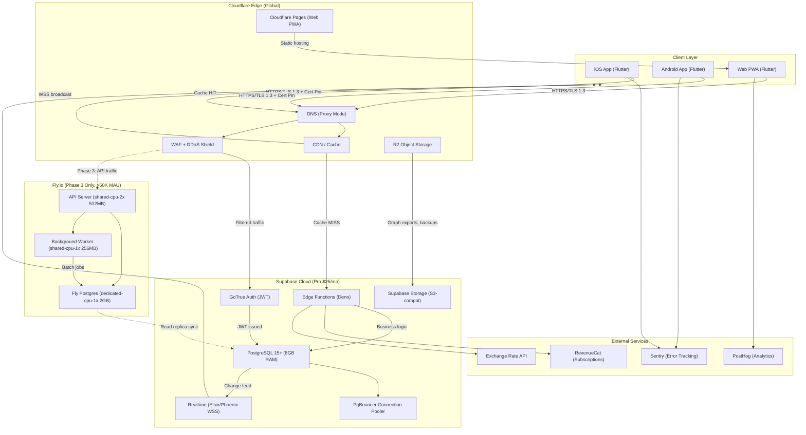

# Cloud Architecture Document — CalcApp

**Role:** Cloud Architect | **Mode:** 1 (DESIGN Phase)  
**Date:** 2025-01-XX  
**Status:** Active  

---

## Table of Contents

1. [Infrastructure Diagram](#1-infrastructure-diagram)
2. [Network Architecture](#2-network-architecture)
3. [Compute & Storage](#3-compute--storage)
4. [High Availability & DR](#4-high-availability--dr)
5. [Scaling Triggers](#5-scaling-triggers)
6. [Cost Guardrails](#6-cost-guardrails)
7. [Security Controls](#7-security-controls)
8. [Monitoring & Alerting](#8-monitoring--alerting)

---

## 1. Infrastructure Diagram



### Data Flow Summary

| Flow | Path | Protocol | Latency Target |
|------|------|----------|----------------|
| Auth request | Client → CF WAF → Supabase Auth | HTTPS/TLS 1.3 | <150ms P95 |
| Sync push | Client → CF WAF → Edge Function → PG | HTTPS/TLS 1.3 | <200ms P95 |
| Sync pull (realtime) | PG → Realtime → Client | WSS | <3s propagation |
| Static assets | Client → CF CDN → Pages | HTTPS | <50ms (cache hit) |
| Graph export upload | Client → CF → Supabase Storage → R2 | HTTPS | <500ms |
| Subscription check | Edge Function → RevenueCat API | HTTPS | <300ms |

---

## 2. Network Architecture

### 2.1 DNS Configuration (Cloudflare)

| Record | Type | Value | Proxy | TTL |
|--------|------|-------|-------|-----|
| `calcapp.io` | A | CF Pages IP | ✅ Orange | Auto |
| `api.calcapp.io` | CNAME | `<project>.supabase.co` | ✅ Orange | Auto |
| `ws.calcapp.io` | CNAME | `<project>.supabase.co` | ❌ DNS-only | Auto |
| `app.calcapp.io` | CNAME | `<pages-project>.pages.dev` | ✅ Orange | Auto |
| `cdn.calcapp.io` | CNAME | `<r2-bucket>.r2.dev` | ✅ Orange | Auto |

**Phase 3 addition:**

| Record | Type | Value | Proxy | TTL |
|--------|------|-------|-------|-----|
| `api.calcapp.io` | CNAME | `calcapp-api.fly.dev` | ✅ Orange | Auto |

### 2.2 CDN Configuration

| Setting | Phase 1 (Free) | Phase 2 (Pro $20/mo) | Phase 3 (Pro) |
|---------|----------------|----------------------|---------------|
| Plan | Free | Pro | Pro |
| Cache TTL (static) | 1 day | 4 hours | 4 hours |
| Cache TTL (API) | No cache | No cache | No cache |
| Browser Cache TTL | 4 hours | 1 hour | 1 hour |
| Cache Level | Standard | Standard | Aggressive |
| Polish (image opt) | ❌ | ✅ Lossy | ✅ Lossy |
| Minify (JS/CSS/HTML) | ✅ | ✅ | ✅ |
| Brotli compression | ✅ | ✅ | ✅ |
| Tiered Caching | ❌ | ✅ Smart | ✅ Smart |
| Argo Smart Routing | ❌ | ❌ | ✅ ($5/mo + usage) |
| Expected hit rate | 80% | 92% | 95% |

**Cache Rules:**

```
# Static assets (immutable hashed filenames)
/assets/* → Cache Everything, Edge TTL: 30 days, Browser TTL: 1 year

# PWA manifest + service worker
/manifest.json, /sw.js → Cache Everything, Edge TTL: 1 hour

# API endpoints — never cache
/api/* → Bypass Cache

# WebSocket — bypass
/realtime/* → Bypass Cache
```

### 2.3 TLS Termination

| Layer | TLS Version | Certificate | Notes |
|-------|-------------|-------------|-------|
| Client ↔ Cloudflare | TLS 1.3 only | Cloudflare Universal (free) | Minimum TLS 1.2 disabled |
| Cloudflare ↔ Supabase | TLS 1.2+ | Full (strict) origin cert | Supabase manages origin |
| Cloudflare ↔ Fly.io (Phase 3) | TLS 1.3 | Fly.io managed cert | Auto-renewed Let's Encrypt |
| Mobile clients | TLS 1.3 | + Certificate pinning | Pin Cloudflare intermediate CA |

**Certificate Pinning (Mobile):**
- Pin: Cloudflare intermediate CA (not leaf — allows rotation)
- Backup pin: DigiCert Global Root G2 (Supabase fallback)
- Pin expiry grace period: 30 days
- Failure mode: hard-fail (reject connection)

### 2.4 WebSocket Routing (Realtime Sync)

| Component | Configuration |
|-----------|---------------|
| Endpoint | `wss://ws.calcapp.io/realtime/v1/websocket` |
| Cloudflare proxy | **Disabled** (DNS-only) — WebSocket via CF adds latency |
| Connection upgrade | HTTP/1.1 → WebSocket at Supabase edge |
| Heartbeat interval | 30 seconds |
| Idle timeout | 60 seconds (client reconnect) |
| Max message size | 256KB |
| Auth | JWT in connection params (verified on connect) |
| Channels | `private:user:{user_id}` (RLS enforced) |
| Reconnection strategy | Exponential backoff: 1s, 2s, 4s, 8s, max 30s |

**Phase 3 WebSocket (Fly.io):**

| Setting | Value |
|---------|-------|
| Load balancer | Fly.io Anycast (auto-routes to nearest region) |
| Sticky sessions | ✅ (via `fly-request-id` cookie) |
| Max connections/machine | 10,000 |
| Scale trigger | >5,000 concurrent connections → add machine |

---

## 3. Compute & Storage

### 3.1 Supabase Specifications by Phase

| Resource | Phase 1 ($25/mo) | Phase 2 ($25/mo) | Phase 3 ($25/mo + addons) |
|----------|------------------|------------------|---------------------------|
| **Plan** | Pro | Pro | Pro + Compute Add-on |
| **Postgres RAM** | 1 GB (shared) | 1 GB (shared) | 2 GB (dedicated, +$50/mo) |
| **Postgres CPU** | 2-core shared | 2-core shared | 2-core dedicated |
| **Postgres Storage** | 8 GB included | 8 GB (expand to 16GB) | 32 GB (+$0.125/GB) |
| **Postgres Connections** | 60 direct / 200 pooled | 60 direct / 200 pooled | 100 direct / 500 pooled |
| **Realtime Connections** | 200 concurrent | 500 concurrent (+$10/mo) | 5,000 concurrent (+$100/mo) |
| **Edge Function Invocations** | 500K/mo included | 2M/mo (+$2/million) | 10M/mo (+$2/million) |
| **Storage** | 100 GB included | 100 GB included | 200 GB (+$0.021/GB) |
| **Bandwidth** | 250 GB included | 250 GB included | 500 GB (+$0.09/GB) |
| **Daily Backups** | 7-day retention | 7-day retention | 14-day retention (+$25/mo) |
| **Point-in-Time Recovery** | ❌ | ❌ | ✅ (+$100/mo) |
| **Read Replicas** | ❌ | ❌ | 1 replica (+$75/mo) |
| **MAU supported** | 0–10K | 10K–50K | 50K–250K |

### 3.2 Fly.io Machine Specifications (Phase 3 Only, >50K MAU)

| Machine | Spec | Count | Region | Cost |
|---------|------|-------|--------|------|
| **API Server** | `shared-cpu-2x`, 512MB RAM | 2 (HA) | `iad` (US-East) | $12.41/mo each |
| **API Server (scale)** | `shared-cpu-2x`, 512MB RAM | +1 per 25K MAU | `iad` | $12.41/mo each |
| **Background Worker** | `shared-cpu-1x`, 256MB RAM | 1 | `iad` | $3.19/mo |
| **Fly Postgres** | `dedicated-cpu-1x`, 2GB RAM, 20GB vol | 2 (primary + replica) | `iad` | $31.92/mo each |
| **Fly Postgres (scale)** | `dedicated-cpu-2x`, 4GB RAM, 40GB vol | 2 (HA pair) | `iad` + `lhr` | $62.83/mo each |

**Phase 3 Fly.io monthly estimate:**

| Component | Count | Unit Cost | Total |
|-----------|-------|-----------|-------|
| API machines (2x HA) | 2 | $12.41 | $24.82 |
| Worker machine | 1 | $3.19 | $3.19 |
| Postgres HA pair | 2 | $31.92 | $63.84 |
| Bandwidth (100GB) | — | — | $0 (included) |
| IPv4 addresses | 2 | $2.00 | $4.00 |
| **Fly.io Total** | — | — | **$95.85/mo** |

**At 250K MAU (max Phase 3 self-hosted):**

| Component | Count | Unit Cost | Total |
|-----------|-------|-----------|-------|
| API machines | 6 | $12.41 | $74.46 |
| Worker machines | 2 | $3.19 | $6.38 |
| Postgres (scaled) | 2 | $62.83 | $125.66 |
| Bandwidth (500GB) | — | $0.02/GB overage | $5.00 |
| IPv4 addresses | 4 | $2.00 | $8.00 |
| **Fly.io Total (scaled)** | — | — | **$219.50/mo** |

### 3.3 Postgres Sizing & Growth

| Metric | Phase 1 | Phase 2 | Phase 3 |
|--------|---------|---------|---------|
| **Total rows** | <500K | 500K–5M | 5M–50M |
| **DB size** | <1 GB | 1–4 GB | 4–20 GB |
| **Avg row size (calculations)** | 512 bytes (encrypted payload) | 512 bytes | 512 bytes |
| **Write rate** | <10 TPS | 10–100 TPS | 100–1,000 TPS |
| **Read rate** | <50 QPS | 50–500 QPS | 500–5,000 QPS |
| **Connection pool size** | 20 (PgBouncer transaction mode) | 50 | 200 |
| **Indexes** | 5 (user_id, created_at, mode, favorite, FTS) | 8 | 12 |
| **Vacuum frequency** | Default (autovacuum) | Tuned: dead_tuple_percent=5% | Aggressive: every 2h |

**Storage Growth Projection:**

```
Per-user storage = (avg_calculations × row_size) + (variables × 128B) + (templates × 256B)
                 = (200 × 512B) + (10 × 128B) + (2 × 256B)
                 = 100KB + 1.3KB + 0.5KB ≈ 102KB/user

Phase 1 (10K users): 10,000 × 102KB = ~1 GB
Phase 2 (50K users): 50,000 × 102KB = ~5 GB
Phase 3 (250K users): 250,000 × 102KB = ~25 GB
```

### 3.4 Cloudflare R2 Storage

| Usage | Phase 1 | Phase 2 | Phase 3 |
|-------|---------|---------|---------|
| **Graph exports** | <1 GB | 1–10 GB | 10–100 GB |
| **Cost** | $0 (10GB free) | $0.015/GB/mo | $0.015/GB/mo |
| **Egress** | $0 (always free) | $0 | $0 |
| **Monthly cost** | $0 | $0 | ~$1.50 |

---

## 4. High Availability & DR

### 4.1 Availability Targets

| Component | Target SLA | Supabase SLA | Achieved |
|-----------|------------|--------------|----------|
| API (HTTPS) | 99.9% | 99.95% (Pro) | ✅ |
| Database (Postgres) | 99.9% | 99.95% (Pro) | ✅ |
| Realtime (WebSocket) | 99.5% | 99.9% | ✅ |
| CDN (static assets) | 99.99% | Cloudflare 100% SLA | ✅ |
| Auth service | 99.9% | 99.95% | ✅ |

**Composite availability:** 99.9% × 99.9% × 99.5% = ~99.3% (meets 99.9% per component)

### 4.2 Recovery Objectives

| Metric | Target | Strategy |
|--------|--------|----------|
| **RPO** (Recovery Point Objective) | <1 hour | Daily snapshots + WAL archiving (continuous) |
| **RTO** (Recovery Time Objective) | <4 hours | Automated failover (Supabase) / manual Fly.io |
| **MTTR** (Mean Time To Recover) | <30 minutes | Supabase auto-recovery for most failures |

### 4.3 Backup Schedule

| Backup Type | Frequency | Retention | Storage | Cost |
|-------------|-----------|-----------|---------|------|
| **Automated snapshot** | Daily at 02:00 UTC | 7 days (Phase 1-2), 14 days (Phase 3) | Supabase managed | Included in Pro |
| **WAL archiving** | Continuous (Phase 3) | 7 days | Supabase PITR storage | +$100/mo |
| **Manual export** | Weekly (Sunday 03:00 UTC) | 30 days | R2 bucket `calcapp-backups` | ~$0.50/mo |
| **R2 cross-region copy** | Daily | 7 days | R2 `us-west` bucket | ~$0.50/mo |

### 4.4 Failover Plan

```
┌─────────────────────────────────────────────────────────────────┐
│ SCENARIO 1: Supabase Postgres Down (Phase 1-2)                  │
├─────────────────────────────────────────────────────────────────┤
│ Detection: Health check fails 3x in 60s                         │
│ Impact: Sync unavailable, app works offline (Isar local DB)     │
│ Action:                                                         │
│   1. Clients auto-switch to offline mode (built-in)             │
│   2. Alert fires to #incidents Slack channel                    │
│   3. Wait for Supabase auto-recovery (typical: 5-15 min)       │
│   4. If >30 min: contact Supabase support (Pro priority)        │
│   5. If >2 hr: restore from latest snapshot to new project      │
│ RTO: <30 min (auto) / <4 hr (manual restore)                   │
│ RPO: 0 (WAL) or <24h (snapshot)                                │
└─────────────────────────────────────────────────────────────────┘

┌─────────────────────────────────────────────────────────────────┐
│ SCENARIO 2: Fly.io API Down (Phase 3)                           │
├─────────────────────────────────────────────────────────────────┤
│ Detection: Fly.io health check + Cloudflare health check        │
│ Impact: API requests fail                                       │
│ Action:                                                         │
│   1. Fly.io auto-restarts crashed machine (<10s)                │
│   2. If machine unrecoverable: Fly scales replacement (<60s)    │
│   3. If region down: Cloudflare fails over to backup region     │
│   4. Fallback: route traffic direct to Supabase Edge Functions  │
│ RTO: <2 min (auto) / <15 min (region failover)                 │
└─────────────────────────────────────────────────────────────────┘

┌─────────────────────────────────────────────────────────────────┐
│ SCENARIO 3: Cloudflare Outage (Rare)                            │
├─────────────────────────────────────────────────────────────────┤
│ Detection: External uptime monitor (UptimeRobot/Checkly)        │
│ Impact: All web traffic, CDN, WAF unavailable                   │
│ Action:                                                         │
│   1. Mobile apps retry direct to Supabase (fallback URL)        │
│   2. DNS TTL is 5 min — update to direct IPs if prolonged       │
│   3. Web PWA unavailable until CF recovers                      │
│ RTO: depends on Cloudflare (historical: <30 min)               │
└─────────────────────────────────────────────────────────────────┘
```

### 4.5 Client-Side Resilience

| Feature | Implementation |
|---------|---------------|
| Offline-first architecture | All operations work locally via Isar DB |
| Sync queue | Failed syncs queued with exponential retry |
| Conflict resolution | LWW vector clocks — deterministic, no user intervention |
| Fallback API URL | Hardcoded backup URL bypassing CF (emergency only) |
| Grace period | App fully functional offline for unlimited duration |

---

## 5. Scaling Triggers

### 5.1 Phase Transition Triggers

| Metric | Threshold | Action | From → To |
|--------|-----------|--------|-----------|
| MAU | >10,000 | Upgrade monitoring, add Cloudflare Pro | Phase 1 → 2 entry |
| Concurrent WS connections | >200 | Purchase Realtime add-on ($10/mo) | Phase 1 → 2 |
| Database size | >6 GB | Expand storage allocation | Phase 1 → 2 |
| MAU | >50,000 | Deploy Fly.io API, add read replica | Phase 2 → 3 entry |
| Write TPS | >100 | Deploy Fly.io worker for batch processing | Phase 2 → 3 |
| API latency P95 | >200ms for 1 hour | Add compute resources | Any phase |

### 5.2 Auto-Scaling Rules (Phase 3 — Fly.io)

| Metric | Threshold | Scale Action | Cooldown |
|--------|-----------|--------------|----------|
| CPU utilization | >70% for 5 min | Add 1 API machine | 10 min |
| CPU utilization | <20% for 30 min | Remove 1 API machine (min: 2) | 15 min |
| Memory utilization | >80% for 5 min | Scale machine to next tier | 30 min |
| Concurrent connections | >5,000 per machine | Add 1 API machine | 5 min |
| Request queue depth | >100 pending for 2 min | Add 1 API machine | 5 min |
| Background job queue | >1,000 pending | Add 1 worker machine | 10 min |

### 5.3 Database Scaling Triggers

| Metric | Threshold | Action | Est. Cost Impact |
|--------|-----------|--------|------------------|
| Connection pool exhaustion | >80% pool utilized | Increase PgBouncer pool size | $0 (config) |
| Connections sustained >150 | 5 min continuous | Enable Supabase pooler mode | $0 (included) |
| Query latency P95 | >100ms | Add indexes or optimize queries | $0 |
| Query latency P95 | >200ms after optimization | Upgrade to dedicated compute | +$50/mo |
| Replication lag | >10s | Scale read replica compute | +$25/mo |
| Storage >80% of allocation | Sustained 24h | Expand storage by 50% | +$1/GB |
| WAL generation | >100MB/hr | Enable PITR + archiving | +$100/mo |

### 5.4 Supabase Realtime Scaling

| Metric | Threshold | Action | Cost |
|--------|-----------|--------|------|
| Concurrent WS connections | >200 | Purchase 500-connection add-on | +$10/mo |
| Concurrent WS connections | >500 | Purchase 2,000-connection add-on | +$50/mo |
| Concurrent WS connections | >2,000 | Purchase 5,000-connection add-on | +$100/mo |
| Concurrent WS connections | >5,000 | Migrate to Fly.io WebSocket server | +$50/mo |
| Message throughput | >10,000 msg/min | Enable message batching (client-side) | $0 |
| Channel subscriptions | >50 per connection | Review channel architecture | $0 |

### 5.5 Cloudflare Scaling

| Metric | Threshold | Action | Cost |
|--------|-----------|--------|------|
| Monthly requests | >10M | Evaluate Argo Smart Routing | +$5/mo base |
| Cache hit rate | <85% | Review cache rules, add page rules | $0 |
| WAF blocked requests | >10K/day | Review rules, consider rate limiting upgrade | $0–$20/mo |
| Origin bandwidth | >200 GB/mo | Optimize payloads, add compression | $0 |

---

## 6. Cost Guardrails

### 6.1 Budget Caps by Phase

| Service | Phase 1 Cap | Phase 2 Cap | Phase 3 Cap |
|---------|-------------|-------------|-------------|
| Supabase (total) | $30/mo | $50/mo | $350/mo |
| Cloudflare | $0/mo | $25/mo | $50/mo |
| Fly.io | $0/mo | $0/mo | $500/mo |
| R2 Storage | $0/mo | $5/mo | $20/mo |
| **Cloud Total** | **$30/mo** | **$80/mo** | **$920/mo** |
| **Budget Allocation** | **$75/mo** | **$400/mo** | **$2,500/mo** |
| **Remaining (other services)** | **$45/mo** | **$320/mo** | **$1,580/mo** |

### 6.2 Auto-Scaling Limits (Hard Caps)

| Resource | Min | Max (Phase 1) | Max (Phase 2) | Max (Phase 3) |
|----------|-----|---------------|---------------|---------------|
| Fly.io API machines | — | — | — | 8 |
| Fly.io worker machines | — | — | — | 3 |
| Supabase Realtime connections | — | 200 | 500 | 5,000 |
| Edge Function invocations/mo | — | 500K | 2M | 10M |
| Postgres storage | — | 8 GB | 16 GB | 64 GB |
| R2 storage | — | 10 GB | 50 GB | 200 GB |
| Bandwidth (Supabase) | — | 250 GB | 250 GB | 1 TB |

### 6.3 Spend Alert Configuration

| Alert Level | Trigger (% of cap) | Notification | Response Time |
|-------------|---------------------|--------------|---------------|
| 🟡 Warning | 60% | Slack `#finops-alerts` | 24 hours |
| 🟠 Alert | 80% | Slack + Email to eng lead | 4 hours |
| 🔴 Critical | 95% | PagerDuty + auto-block provisioning | 1 hour |
| 🚨 Emergency | 100% exceeded | Auto-disable non-essential + CTO page | 30 minutes |

### 6.4 Cost Kill Switches

| Trigger | Automated Action | Manual Approval Needed |
|---------|-----------------|----------------------|
| Supabase bandwidth >200GB in Phase 1 | Throttle non-essential Edge Functions | No |
| Fly.io machines >$400/mo | Prevent new machine creation | Yes (CTO) |
| R2 egress spike (shouldn't happen — R2 is free egress) | Alert only | No |
| Unknown Supabase addon charge | Alert + investigate | Yes |
| Any single service >150% of cap | Downgrade or disable | Yes (Eng Lead) |

---

## 7. Security Controls

### 7.1 WAF Rules (Cloudflare)

| Rule | Action | Priority | Scope |
|------|--------|----------|-------|
| OWASP Core Ruleset | Managed (Medium sensitivity) | 1 | `api.calcapp.io` |
| Rate limit: 100 req/min (Free users) | Block (1 min) | 2 | `/api/*` |
| Rate limit: 500 req/min (Pro users) | Block (1 min) | 3 | `/api/*` |
| Rate limit: 10 req/min (auth endpoints) | Challenge (5 min) | 4 | `/auth/*` |
| Block known bad bots | Block | 5 | All |
| Block non-TLS 1.3 (mobile API) | Block | 6 | `api.calcapp.io` |
| Geo-block sanctioned countries | Block | 7 | All |
| Challenge on >5 failed auth attempts | JS Challenge | 8 | `/auth/token` |
| SQL injection signatures | Block + Log | 9 | `/api/*` |
| XSS payload detection | Block + Log | 10 | `/api/*` |

### 7.2 DDoS Protection (Cloudflare)

| Layer | Protection | Configuration |
|-------|-----------|---------------|
| L3/L4 (Network) | Always-on (Cloudflare Free) | Automatic — no config needed |
| L7 (Application) | Rate limiting + WAF | Custom rules above |
| WebSocket | Connection limit per IP | Max 5 concurrent WS per IP |
| API | Adaptive rate limiting | Per-JWT token bucket (Phase 2+) |
| Emergency | Under Attack Mode | Manual enable via dashboard/API |

**DDoS Response Plan:**

```
1. Auto-detected → Cloudflare mitigates (no action needed for L3/L4)
2. L7 attack detected (>10K req/s from single source):
   → Rate limiting auto-blocks
   → Alert fires to #security channel
3. Sustained attack (>1M req/min):
   → Enable "Under Attack Mode" via API
   → All visitors get JS challenge (5s interstitial)
   → Review attack patterns, add specific blocks
4. Post-attack:
   → Review logs within 24h
   → Update WAF rules if new pattern identified
   → Document in security incident log
```

### 7.3 Secrets Management & Rotation

| Secret | Storage | Rotation Frequency | Auto-Rotate |
|--------|---------|-------------------|-------------|
| Supabase `service_role` key | GitHub Secrets + Fly.io Secrets | 90 days | ❌ Manual |
| Supabase `anon` key | Client-side (public, RLS-protected) | Never (public) | N/A |
| JWT signing secret | Supabase managed | Supabase handles | ✅ |
| Database password | Supabase managed | 90 days | ❌ Manual |
| RevenueCat API key | GitHub Secrets + Edge Function env | 180 days | ❌ Manual |
| Sentry DSN | Client-side (public) | Never | N/A |
| R2 access keys | Cloudflare dashboard + CI secrets | 90 days | ❌ Manual |
| Fly.io deploy token | GitHub Secrets | 90 days | ❌ Manual |
| Encryption salt (per-user) | Supabase Postgres (server column) | Never (per-user, immutable) | N/A |

**Rotation Procedure:**
1. Generate new secret in service dashboard
2. Update CI/CD secrets (GitHub Actions)
3. Deploy with new secret (zero-downtime: old secret valid for 24h overlap)
4. Verify new secret works in production
5. Revoke old secret after 24h
6. Log rotation in `#security-ops` channel

### 7.4 Network Isolation

| Boundary | Isolation Method | Notes |
|----------|-----------------|-------|
| Client ↔ Backend | TLS 1.3 + WAF filtering | No direct DB access |
| Supabase Postgres | RLS policies per table | No public schema access without JWT |
| Supabase Edge Functions | Deno sandbox (V8 isolate) | No filesystem access, no network except allowlist |
| Fly.io internal | Private networking (WireGuard mesh) | Machines communicate via `*.internal` |
| Fly.io ↔ Supabase | Allowlisted IPs (Fly.io egress) | Phase 3 only |
| R2 ↔ Public | Presigned URLs only (time-limited) | No public bucket access |

### 7.5 Supabase Row-Level Security (RLS)

```sql
-- All tables: users can only access their own data
ALTER TABLE calculations ENABLE ROW LEVEL SECURITY;

CREATE POLICY "Users can read own calculations"
  ON calculations FOR SELECT
  USING (auth.uid() = user_id);

CREATE POLICY "Users can insert own calculations"
  ON calculations FOR INSERT
  WITH CHECK (auth.uid() = user_id);

CREATE POLICY "Users can update own calculations"
  ON calculations FOR UPDATE
  USING (auth.uid() = user_id);

CREATE POLICY "Users can soft-delete own calculations"
  ON calculations FOR DELETE
  USING (auth.uid() = user_id);

-- Rate limit via Edge Function middleware (not RLS)
-- Service role bypasses RLS for admin/migration tasks only
```

---

## 8. Monitoring & Alerting

### 8.1 Services to Monitor

| Service | Tool | Key Metrics | Dashboard |
|---------|------|-------------|-----------|
| Supabase Postgres | Supabase Dashboard + PgHero | Connections, query latency, cache hit ratio, storage | Built-in |
| Supabase Auth | Supabase Dashboard | Sign-ups/day, auth errors, token refreshes | Built-in |
| Supabase Realtime | Supabase Dashboard | Active connections, messages/sec, disconnects | Built-in |
| Cloudflare | CF Analytics | Requests, bandwidth, cache hit rate, threats blocked | Built-in |
| Fly.io (Phase 3) | Fly Metrics + Grafana | CPU, memory, request latency, error rate | Fly Dashboard |
| Client errors | Sentry | Error rate, crash-free rate, P95 latency | Sentry UI |
| User analytics | PostHog | DAU/MAU, feature adoption, funnel conversion | PostHog UI |
| Uptime | UptimeRobot (free 50 monitors) | Endpoint availability, response time | UptimeRobot |
| Costs | Manual + Supabase billing API | Spend per service, trend | Spreadsheet → Grafana (Phase 2) |

### 8.2 Alert Thresholds

| Metric | Warning | Critical | Action |
|--------|---------|----------|--------|
| API P95 latency | >150ms | >200ms | Investigate queries / add index |
| API error rate (5xx) | >1% | >5% | Page on-call, check logs |
| Postgres connections | >70% pool | >90% pool | Scale pool / investigate leaks |
| Postgres query time P95 | >50ms | >100ms | EXPLAIN ANALYZE, add indexes |
| DB cache hit ratio | <95% | <90% | Increase shared_buffers / check queries |
| Realtime disconnection rate | >5%/hr | >15%/hr | Check Supabase status, review client code |
| Sync latency (client → server → client) | >3s | >10s | Check WS health, queue depth |
| Client crash-free rate (Sentry) | <99.5% | <99% | Hotfix release |
| Cloudflare WAF blocks | >1K/hr | >10K/hr (attack) | Review rules, enable Under Attack |
| Supabase storage usage | >70% alloc | >90% alloc | Expand or clean up |
| Monthly cost vs budget | >80% | >95% | FinOps review / throttle |

### 8.3 Health Check Endpoints

| Endpoint | Check | Interval | Timeout | Alert After |
|----------|-------|----------|---------|-------------|
| `GET /api/v1/health` | API + DB connectivity | 60s | 5s | 3 failures |
| `GET /api/v1/health/db` | Postgres SELECT 1 | 60s | 3s | 3 failures |
| `GET /api/v1/health/realtime` | WS connection test | 300s | 10s | 2 failures |
| `GET https://app.calcapp.io` | Web PWA availability | 60s | 10s | 3 failures |

### 8.4 On-Call Rotation

| Phase | Rotation | Escalation | Tools |
|-------|----------|------------|-------|
| **Phase 1** | Founder only (24/7) | N/A | UptimeRobot SMS + Slack | 
| **Phase 2** | 2-person rotation (weekly) | Founder as backup | PagerDuty (free tier) + Slack |
| **Phase 3** | 3-person rotation (weekly, follow-the-sun) | Eng Lead → CTO | PagerDuty Pro + Slack + phone |

**Escalation Policy:**

```
Level 1: Primary on-call (respond within 15 min)
  └─ No ack in 15 min →
Level 2: Secondary on-call (respond within 10 min)
  └─ No ack in 10 min →
Level 3: Engineering Lead (respond within 5 min)
  └─ No ack in 5 min →
Level 4: CTO (immediate response, any hour)
```

**Incident Severity Levels:**

| Severity | Definition | Response Time | Example |
|----------|-----------|---------------|---------|
| SEV1 | Complete service outage | <15 min | API down, all users affected |
| SEV2 | Degraded performance / partial outage | <30 min | Sync broken, API slow >500ms |
| SEV3 | Minor issue, no user impact | <4 hr | Elevated error rate, monitoring gap |
| SEV4 | Improvement needed | Next business day | Cache hit rate dropped, cost spike |

### 8.5 Runbook Quick Reference

| Scenario | First Response |
|----------|---------------|
| API 5xx spike | Check Supabase status page → Edge Function logs → PG connections |
| Sync lag >10s | Check Realtime dashboard → WS connection count → PG replication |
| Auth failures | Check Supabase Auth logs → JWT expiry → GoTrue service health |
| Cost alert | Check billing dashboard → identify spike source → apply throttle if needed |
| DDoS detected | Verify CF mitigation active → enable Under Attack if needed → monitor |
| DB connection exhaustion | Kill idle connections → check for leaks → increase pool if justified |

---

## Appendix A: Phase Transition Checklist

### Phase 1 → Phase 2 (at ~10K MAU)

- [ ] Upgrade Cloudflare Free → Pro ($20/mo)
- [ ] Enable Cloudflare Smart Tiered Caching
- [ ] Purchase Supabase Realtime 500-connection add-on ($10/mo)
- [ ] Set up PagerDuty free tier for 2-person rotation
- [ ] Configure all Supabase billing alerts
- [ ] Enable PostHog Growth plan if events >1M/mo
- [ ] Set up weekly cost review meeting

### Phase 2 → Phase 3 (at ~50K MAU)

- [ ] Deploy Fly.io API server (2x HA in `iad`)
- [ ] Deploy Fly.io Postgres (primary + replica)
- [ ] Update DNS: `api.calcapp.io` → Fly.io
- [ ] Enable Supabase PITR ($100/mo)
- [ ] Add Supabase read replica ($75/mo)
- [ ] Deploy background worker on Fly.io
- [ ] Configure Fly.io auto-scaling rules
- [ ] Migrate Edge Functions → Fly.io API for hot paths
- [ ] Set up 3-person on-call rotation
- [ ] Negotiate annual contracts (PostHog, Sentry)
- [ ] Enable Argo Smart Routing on Cloudflare ($5/mo + usage)

---

## Appendix B: Architecture Decision Record

### ADR-CLOUD-001: Supabase as Primary Backend (Phase 1-2)

**Status:** Accepted  
**Context:** Need managed Postgres + Auth + Realtime at low cost for early stages.  
**Decision:** Use Supabase Pro ($25/mo) as single backend platform.  
**Rationale:** Eliminates ops overhead, provides Auth/Realtime/Storage bundled, sufficient for <50K MAU. Migration path to Fly.io exists for Phase 3.  
**Trade-offs:** Vendor lock-in on Auth (mitigated: standard JWT), limited Postgres tuning.

### ADR-CLOUD-002: Cloudflare for CDN + WAF + DNS

**Status:** Accepted  
**Context:** Need CDN with DDoS protection, free tier for Phase 1.  
**Decision:** Cloudflare Free (Phase 1) → Pro (Phase 2+).  
**Rationale:** Industry-leading DDoS protection included free. R2 has zero egress fees. Pages hosts web PWA. Unified security + performance layer.  
**Trade-offs:** WebSocket proxying adds latency (mitigated: DNS-only mode for WS).

### ADR-CLOUD-003: Fly.io for Self-Hosted Compute (Phase 3)

**Status:** Accepted  
**Context:** At >50K MAU, need custom API logic beyond Edge Functions, dedicated compute.  
**Decision:** Deploy on Fly.io with shared-cpu machines.  
**Rationale:** Pay-per-use, no minimum commitment, WireGuard mesh networking, Anycast routing, easy scaling. Cheaper than AWS/GCP for this workload size.  
**Trade-offs:** Smaller ecosystem than AWS, fewer managed services (acceptable — Supabase covers DB/Auth).

### ADR-CLOUD-004: DNS-Only Mode for WebSocket Traffic

**Status:** Accepted  
**Context:** Cloudflare WebSocket proxy adds 20-50ms latency and has connection limits on Free/Pro.  
**Decision:** Use DNS-only (grey cloud) for `ws.calcapp.io`.  
**Rationale:** Direct WS connection to Supabase Realtime avoids CF overhead. Acceptable since Supabase has its own DDoS protection for Realtime.  
**Trade-offs:** No CF WAF on WebSocket traffic (mitigated: Supabase auth on WS connect, rate limiting via channel subscriptions).

---

*Document generated by Cloud Architect — CalcApp Mode 1 DESIGN Phase*  
*Next review: Phase 1 completion (M6) or at 10K MAU milestone*
