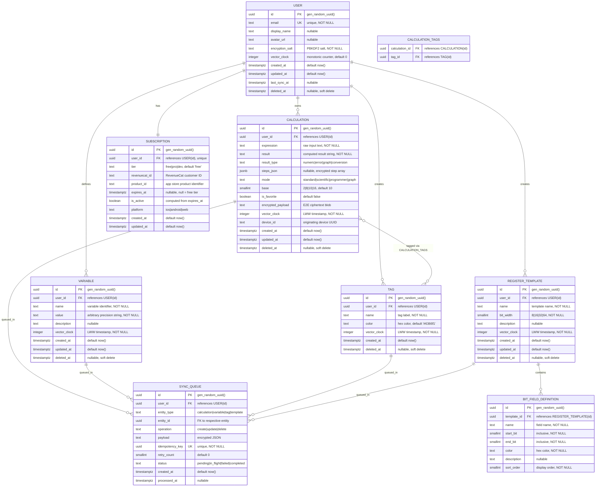

# CalcApp — Entity Relationship Diagram & Database Design

**Version:** 1.0  
**Role:** Database Architect  
**Phase:** DESIGN (Mode 1 Full Army Pipeline)  
**Database:** PostgreSQL 15+ via Supabase  
**Date:** 2025-01-XX  
**Status:** Draft

---

## 1. Entity Relationship Diagram



---

## 2. Entity Descriptions & Field Documentation

### 2.1 USER

The core identity table. Each row maps 1:1 with a Supabase Auth user (`auth.users`). Contains sync metadata and encryption parameters. **PII fields:** `email`, `display_name`, `avatar_url`.

| Field | Type | Constraints | Description |
|-------|------|-------------|-------------|
| id | UUID | PK, default gen_random_uuid() | Matches auth.users.id |
| email | TEXT | UNIQUE, NOT NULL | User login email (PII) |
| display_name | TEXT | nullable, max 100 chars | Public display name (PII) |
| avatar_url | TEXT | nullable | Profile image URL (PII) |
| encryption_salt | TEXT | NOT NULL | Per-user PBKDF2 salt for E2E key derivation |
| vector_clock | INTEGER | NOT NULL, default 0 | Global monotonic counter for sync ordering |
| created_at | TIMESTAMPTZ | NOT NULL, default now() | Account creation timestamp |
| updated_at | TIMESTAMPTZ | NOT NULL, default now() | Last profile modification |
| last_sync_at | TIMESTAMPTZ | nullable | Last successful sync from any device |
| deleted_at | TIMESTAMPTZ | nullable | Soft delete for GDPR scheduled deletion |

### 2.2 CALCULATION

The primary data entity. Stores encrypted calculation payloads for cross-device sync. Server never sees plaintext expressions/results — those fields exist for server-side search support only if the user opts in to server-side indexing (future). The `encrypted_payload` contains the actual synced data.

| Field | Type | Constraints | Description |
|-------|------|-------------|-------------|
| id | UUID | PK | Client-generated UUID v4 |
| user_id | UUID | FK → USER(id), NOT NULL | Owner reference |
| expression | TEXT | NOT NULL, max 500 chars | Raw input expression (for local search) |
| result | TEXT | NOT NULL | Computed result string |
| result_type | TEXT | NOT NULL, CHECK IN enum | numeric, error, graph, conversion |
| steps_json | JSONB | nullable | Step-by-step evaluation trace |
| mode | TEXT | NOT NULL, CHECK IN enum | standard, scientific, programmer, graph |
| base | SMALLINT | NOT NULL, default 10, CHECK IN (2,8,10,16) | Number base for programmer mode |
| is_favorite | BOOLEAN | NOT NULL, default false | Pinned status (US-009) |
| encrypted_payload | TEXT | nullable | E2E encrypted blob for sync |
| vector_clock | INTEGER | NOT NULL, default 0 | LWW conflict resolution timestamp |
| device_id | TEXT | nullable | Originating device identifier |
| created_at | TIMESTAMPTZ | NOT NULL, default now() | Original creation time |
| updated_at | TIMESTAMPTZ | NOT NULL, default now() | Last modification time |
| deleted_at | TIMESTAMPTZ | nullable | Soft delete timestamp |

### 2.3 VARIABLE

User-defined named constants/values for reuse in expressions (US-015). Synced across devices.

| Field | Type | Constraints | Description |
|-------|------|-------------|-------------|
| id | UUID | PK | Client-generated UUID |
| user_id | UUID | FK → USER(id), NOT NULL | Owner reference |
| name | TEXT | NOT NULL, max 50 chars | Variable identifier (unique per user) |
| value | TEXT | NOT NULL | Stored as string for arbitrary precision |
| description | TEXT | nullable, max 200 chars | User-provided description |
| vector_clock | INTEGER | NOT NULL, default 0 | LWW sync timestamp |
| created_at | TIMESTAMPTZ | NOT NULL, default now() | Creation time |
| updated_at | TIMESTAMPTZ | NOT NULL, default now() | Last update time |
| deleted_at | TIMESTAMPTZ | nullable | Soft delete timestamp |

### 2.4 REGISTER_TEMPLATE

Hardware register layout definitions for the bit field visualizer (US-016). Contains metadata; actual field definitions in BIT_FIELD_DEFINITION.

| Field | Type | Constraints | Description |
|-------|------|-------------|-------------|
| id | UUID | PK | Client-generated UUID |
| user_id | UUID | FK → USER(id), NOT NULL | Owner reference |
| name | TEXT | NOT NULL, max 100 chars | Template name (e.g., "STATUS_REG") |
| bit_width | SMALLINT | NOT NULL, CHECK IN (8,16,32,64) | Register width in bits |
| description | TEXT | nullable, max 500 chars | Register purpose description |
| vector_clock | INTEGER | NOT NULL, default 0 | LWW sync timestamp |
| created_at | TIMESTAMPTZ | NOT NULL, default now() | Creation time |
| updated_at | TIMESTAMPTZ | NOT NULL, default now() | Last update time |
| deleted_at | TIMESTAMPTZ | nullable | Soft delete timestamp |

### 2.5 BIT_FIELD_DEFINITION

Individual bit field ranges within a register template (US-016). Child of REGISTER_TEMPLATE.

| Field | Type | Constraints | Description |
|-------|------|-------------|-------------|
| id | UUID | PK | Auto-generated |
| template_id | UUID | FK → REGISTER_TEMPLATE(id), NOT NULL, ON DELETE CASCADE | Parent template |
| name | TEXT | NOT NULL, max 50 chars | Field name (e.g., "BUSY") |
| start_bit | SMALLINT | NOT NULL, CHECK >= 0 | Inclusive start bit position |
| end_bit | SMALLINT | NOT NULL, CHECK >= start_bit | Inclusive end bit position |
| color | TEXT | NOT NULL, default '#6366f1' | Hex color for visualization |
| description | TEXT | nullable, max 200 chars | Field description |
| sort_order | SMALLINT | NOT NULL, default 0 | Display ordering |

### 2.6 TAG

User-created labels for organizing calculations into categories (US-017). Many-to-many with CALCULATION via join table.

| Field | Type | Constraints | Description |
|-------|------|-------------|-------------|
| id | UUID | PK | Client-generated UUID |
| user_id | UUID | FK → USER(id), NOT NULL | Owner reference |
| name | TEXT | NOT NULL, max 30 chars | Tag label |
| color | TEXT | NOT NULL, default '#6366f1' | Hex color for UI |
| vector_clock | INTEGER | NOT NULL, default 0 | LWW sync timestamp |
| created_at | TIMESTAMPTZ | NOT NULL, default now() | Creation time |
| deleted_at | TIMESTAMPTZ | nullable | Soft delete timestamp |

### 2.7 CALCULATION_TAGS (Join Table)

Many-to-many relationship between calculations and tags (US-017).

| Field | Type | Constraints | Description |
|-------|------|-------------|-------------|
| calculation_id | UUID | FK → CALCULATION(id), ON DELETE CASCADE | Calculation reference |
| tag_id | UUID | FK → TAG(id), ON DELETE CASCADE | Tag reference |
| — | — | PK (calculation_id, tag_id) | Composite primary key |

### 2.8 SYNC_QUEUE

Server-side sync tracking for idempotent operation processing. Ensures exactly-once delivery semantics and retry logic.

| Field | Type | Constraints | Description |
|-------|------|-------------|-------------|
| id | UUID | PK | Auto-generated |
| user_id | UUID | FK → USER(id), NOT NULL | Owner reference |
| entity_type | TEXT | NOT NULL, CHECK IN enum | calculation, variable, tag, template |
| entity_id | UUID | NOT NULL | Reference to synced entity |
| operation | TEXT | NOT NULL, CHECK IN enum | create, update, delete |
| payload | TEXT | nullable | Encrypted JSON payload |
| idempotency_key | UUID | UNIQUE, NOT NULL | Deduplication key (US-007) |
| retry_count | SMALLINT | NOT NULL, default 0 | Number of retry attempts |
| status | TEXT | NOT NULL, default 'pending' | pending, in_flight, failed, completed |
| created_at | TIMESTAMPTZ | NOT NULL, default now() | Queue entry time |
| processed_at | TIMESTAMPTZ | nullable | Completion time |

### 2.9 SUBSCRIPTION

User subscription state synced from RevenueCat webhooks. One subscription per user.

| Field | Type | Constraints | Description |
|-------|------|-------------|-------------|
| id | UUID | PK | Auto-generated |
| user_id | UUID | FK → USER(id), UNIQUE, NOT NULL | 1:1 with user |
| tier | TEXT | NOT NULL, default 'free', CHECK IN enum | free, pro, dev |
| revenuecat_id | TEXT | nullable | RevenueCat customer ID |
| product_id | TEXT | nullable | App store product identifier |
| expires_at | TIMESTAMPTZ | nullable | Subscription expiry (null = free) |
| is_active | BOOLEAN | NOT NULL, default true | Computed from expires_at |
| platform | TEXT | nullable, CHECK IN enum | ios, android, web |
| created_at | TIMESTAMPTZ | NOT NULL, default now() | Record creation |
| updated_at | TIMESTAMPTZ | NOT NULL, default now() | Last webhook update |

---

## 3. Index Strategy

Every index is tied to a documented access pattern from the PRD user stories.

### 3.1 Primary Access Pattern Indexes

| Index Name | Table | Columns | Type | Access Pattern / User Story |
|------------|-------|---------|------|----------------------------|
| `idx_calc_user_created` | CALCULATION | (user_id, created_at DESC) | B-tree | **US-003, US-007:** History list ordered by recency, pagination |
| `idx_calc_user_favorite` | CALCULATION | (user_id, is_favorite) WHERE is_favorite = true | B-tree (partial) | **US-009:** Favorites panel, max 50 items per user |
| `idx_calc_user_mode` | CALCULATION | (user_id, mode, created_at DESC) | B-tree | **US-013:** Filter by mode (programmer/scientific/graph) |
| `idx_calc_user_updated` | CALCULATION | (user_id, updated_at DESC) | B-tree | **US-007:** Sync delta fetch — "give me everything since last_sync_at" |
| `idx_calc_user_deleted` | CALCULATION | (user_id, deleted_at) WHERE deleted_at IS NOT NULL | B-tree (partial) | **US-007:** Include/exclude soft-deleted in sync |
| `idx_calc_expression_fts` | CALCULATION | expression (GIN tsvector) | GIN | **US-008:** Full-text search on expressions |
| `idx_calc_result_fts` | CALCULATION | result (GIN tsvector) | GIN | **US-008:** Search by result value |
| `idx_calc_vector_clock` | CALCULATION | (user_id, vector_clock) | B-tree | **US-007:** LWW conflict detection during sync |

### 3.2 Variable & Template Indexes

| Index Name | Table | Columns | Type | Access Pattern / User Story |
|------------|-------|---------|------|----------------------------|
| `idx_var_user_name` | VARIABLE | (user_id, name) | B-tree (unique) | **US-015:** Variable lookup by name, uniqueness per user |
| `idx_var_user_updated` | VARIABLE | (user_id, updated_at DESC) | B-tree | **US-015:** Sync delta for variables |
| `idx_template_user` | REGISTER_TEMPLATE | (user_id, created_at DESC) | B-tree | **US-016:** List user's register templates |
| `idx_bitfield_template` | BIT_FIELD_DEFINITION | (template_id, sort_order) | B-tree | **US-016:** Ordered field list for a template |

### 3.3 Tag & Join Indexes

| Index Name | Table | Columns | Type | Access Pattern / User Story |
|------------|-------|---------|------|----------------------------|
| `idx_tag_user_name` | TAG | (user_id, name) | B-tree (unique) | **US-017:** Tag uniqueness per user, lookup |
| `idx_calctag_calc` | CALCULATION_TAGS | (calculation_id) | B-tree | **US-017:** Get tags for a calculation |
| `idx_calctag_tag` | CALCULATION_TAGS | (tag_id) | B-tree | **US-017:** Get all calculations for a tag filter |

### 3.4 Sync & Subscription Indexes

| Index Name | Table | Columns | Type | Access Pattern / User Story |
|------------|-------|---------|------|----------------------------|
| `idx_sync_user_status` | SYNC_QUEUE | (user_id, status, created_at) | B-tree | **US-007:** Process pending sync items |
| `idx_sync_idempotency` | SYNC_QUEUE | (idempotency_key) | B-tree (unique) | **US-007:** Idempotent operation deduplication |
| `idx_sync_processed` | SYNC_QUEUE | (processed_at) WHERE status = 'completed' | B-tree (partial) | Retention: cleanup completed items older than 30 days |
| `idx_sub_user` | SUBSCRIPTION | (user_id) | B-tree (unique) | **US-007, Rate Limits:** Tier check on every authenticated request |
| `idx_sub_revenuecat` | SUBSCRIPTION | (revenuecat_id) | B-tree | Webhook processing: update subscription from RevenueCat event |

---

## 4. Partitioning Strategy

### 4.1 CALCULATION Table — Range Partitioning by `created_at`

At scale (>10M rows), the CALCULATION table is the primary growth vector. Strategy:

```
PARTITION BY RANGE (created_at)
  - calculations_2025_q1: '2025-01-01' to '2025-04-01'
  - calculations_2025_q2: '2025-04-01' to '2025-07-01'
  - calculations_2025_q3: '2025-07-01' to '2025-10-01'
  - calculations_2025_q4: '2025-10-01' to '2026-01-01'
  - calculations_default: fallback partition
```

**Rationale:**
- Most queries include `created_at` range (US-008 date filters, US-018 export by date)
- Partition pruning eliminates scanning old quarters for recent-data queries
- Old partitions can be moved to cheaper storage or compressed
- Aligns with retention policy (archive after 2 years)

**Trigger:** Implement partitioning when CALCULATION exceeds 5M rows. Until then, standard table with indexes is sufficient.

### 4.2 SYNC_QUEUE — Range Partitioning by `created_at` (Monthly)

SYNC_QUEUE is high-churn (write-heavy, short-lived). Monthly partitions enable fast DROP of old completed entries.

```
PARTITION BY RANGE (created_at)
  - sync_queue_2025_01
  - sync_queue_2025_02
  - ...
```

**Trigger:** Implement when SYNC_QUEUE exceeds 1M rows/month.

### 4.3 Other Tables

USER, VARIABLE, REGISTER_TEMPLATE, TAG, SUBSCRIPTION: No partitioning needed. Expected to remain under 1M rows for years at projected growth (10K→100K users).

---

## 5. Retention Policy & PII Handling

### 5.1 PII Inventory

| Table | PII Fields | Classification | Legal Basis |
|-------|-----------|---------------|-------------|
| USER | email, display_name, avatar_url | Direct PII | Consent (account creation) |
| CALCULATION | expression, result, steps_json | Indirect PII (may contain personal data) | Legitimate interest (service delivery) |
| SYNC_QUEUE | payload | Indirect PII (encrypted) | Legitimate interest (sync delivery) |

### 5.2 Retention Periods

| Data Category | Retention Period | Action After Expiry |
|---------------|-----------------|---------------------|
| Active user data (all tables) | Indefinite while account active | N/A |
| Soft-deleted calculations | 30 days | Hard delete (permanent removal) |
| Completed sync queue entries | 7 days | Hard delete |
| Failed sync queue entries | 30 days | Hard delete + alert if retry_count > 10 |
| Inactive user accounts (no login 24 months) | 24 months | Email warning at 22 months, delete at 24 |
| GDPR deletion requests | 7 days processing | Cascade hard delete all user data |
| Audit logs (future) | 90 days | Rotate to cold storage |

### 5.3 GDPR Delete Cascade (US-006: POST /api/v1/user/delete-data)

When a user requests account deletion:

1. **Immediate** (within request): Set `USER.deleted_at = now()`
2. **Within 7 days** (scheduled job):
   - Hard DELETE all CALCULATION rows for user
   - Hard DELETE all VARIABLE rows for user
   - Hard DELETE all REGISTER_TEMPLATE rows (CASCADE removes BIT_FIELD_DEFINITION)
   - Hard DELETE all TAG rows (CASCADE removes CALCULATION_TAGS entries)
   - Hard DELETE all SYNC_QUEUE rows for user
   - Hard DELETE SUBSCRIPTION row for user
   - Hard DELETE USER row
   - Call Supabase Auth API to delete auth.users record
   - Notify RevenueCat to cancel subscriptions
3. **Verification**: Automated query confirms zero rows exist for user_id across all tables
4. **Confirmation**: Email sent to user's email (stored temporarily for confirmation only)

### 5.4 Right to Export (GDPR Article 20)

Supported by US-018 (CSV/JSON export). Export includes all user-owned data decrypted client-side.

### 5.5 Data Lifecycle Diagram

```
Created → Active → Soft Deleted → Hard Deleted (permanent)
                         ↓
                   30 days grace
                         ↓
                   Purge job runs
```

---

## 6. Migration Plan

### 6.1 Version Strategy

- **Tool:** Supabase Migrations (built on `supabase migration new`)
- **Naming:** `YYYYMMDDHHMMSS_descriptive_name.sql` (timestamp-based ordering)
- **Location:** `supabase/migrations/`
- **Tracking:** `supabase_migrations.schema_migrations` table (built-in)

### 6.2 Migration Principles

1. **Forward-only:** No down migrations. Rollback = new forward migration that reverts.
2. **Idempotent:** All migrations use `IF NOT EXISTS` / `IF EXISTS` guards.
3. **Zero-downtime:** No migration may lock a table for >5 seconds.
4. **Backward-compatible:** New schema must work with N-1 app version for 48 hours minimum.

### 6.3 Zero-Downtime Migration Patterns

| Operation | Unsafe Pattern ❌ | Safe Pattern ✅ |
|-----------|-------------------|-----------------|
| Add column | ALTER TABLE ... ADD COLUMN ... NOT NULL | Add nullable → backfill → add constraint |
| Drop column | ALTER TABLE ... DROP COLUMN | Stop reading → deploy → drop in next migration |
| Rename column | ALTER TABLE ... RENAME COLUMN | Add new column → backfill → update app → drop old |
| Add index | CREATE INDEX (locks table) | CREATE INDEX CONCURRENTLY (no lock) |
| Change column type | ALTER TABLE ... ALTER COLUMN TYPE | Add new column → backfill → swap reads → drop old |
| Add NOT NULL | ALTER TABLE ... SET NOT NULL (full scan lock) | ADD CONSTRAINT ... NOT VALID → VALIDATE CONSTRAINT |

### 6.4 Large Table Migration Strategy (CALCULATION >1M rows)

For operations on the CALCULATION table after it exceeds 1M rows:

1. **Backfill pattern:** Use batched updates (1000 rows/batch, 100ms sleep between batches)
2. **Index creation:** Always `CONCURRENTLY` — no table lock
3. **Column addition:** Always nullable first, backfill, then constraint
4. **Partitioning transition:** Use `pg_partman` extension to convert existing table to partitioned without downtime

### 6.5 Initial Migration Sequence

```
001_20250115000000_create_users.sql
002_20250115000001_create_calculations.sql
003_20250115000002_create_variables.sql
004_20250115000003_create_register_templates.sql
005_20250115000004_create_bit_field_definitions.sql
006_20250115000005_create_tags.sql
007_20250115000006_create_calculation_tags.sql
008_20250115000007_create_sync_queue.sql
009_20250115000008_create_subscriptions.sql
010_20250115000009_create_indexes.sql
011_20250115000010_create_rls_policies.sql
012_20250115000011_create_triggers.sql
013_20250115000012_create_functions.sql
```

### 6.6 Testing Migrations

- Every migration tested against a shadow database (`supabase db reset` in CI)
- Migration must complete in <30 seconds on test dataset (100K rows per table)
- Rollback migration written and tested (but not auto-applied)
- Schema diff validated: `supabase db diff` shows expected changes only

---

## 7. Capacity Estimates

| Metric | Year 1 | Year 2 | Year 3 |
|--------|--------|--------|--------|
| Users | 10K | 100K | 500K |
| Calculations/user/day | 25 avg | 30 avg | 30 avg |
| Total calculations | 91M | 1.1B | 5.5B |
| CALCULATION row size | ~500 bytes | ~500 bytes | ~500 bytes |
| CALCULATION table size | 45 GB | 550 GB | 2.7 TB |
| Sync operations/day | 50K | 500K | 2.5M |

**Conclusion:** Partitioning becomes essential in Year 2. Plan implementation at 5M rows (~Month 7).
