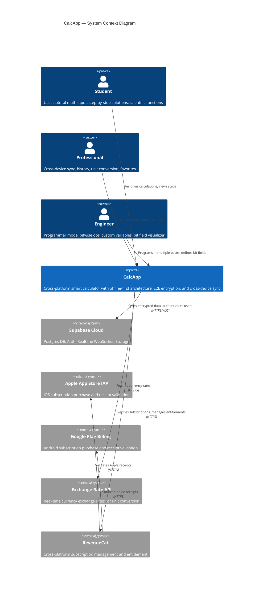
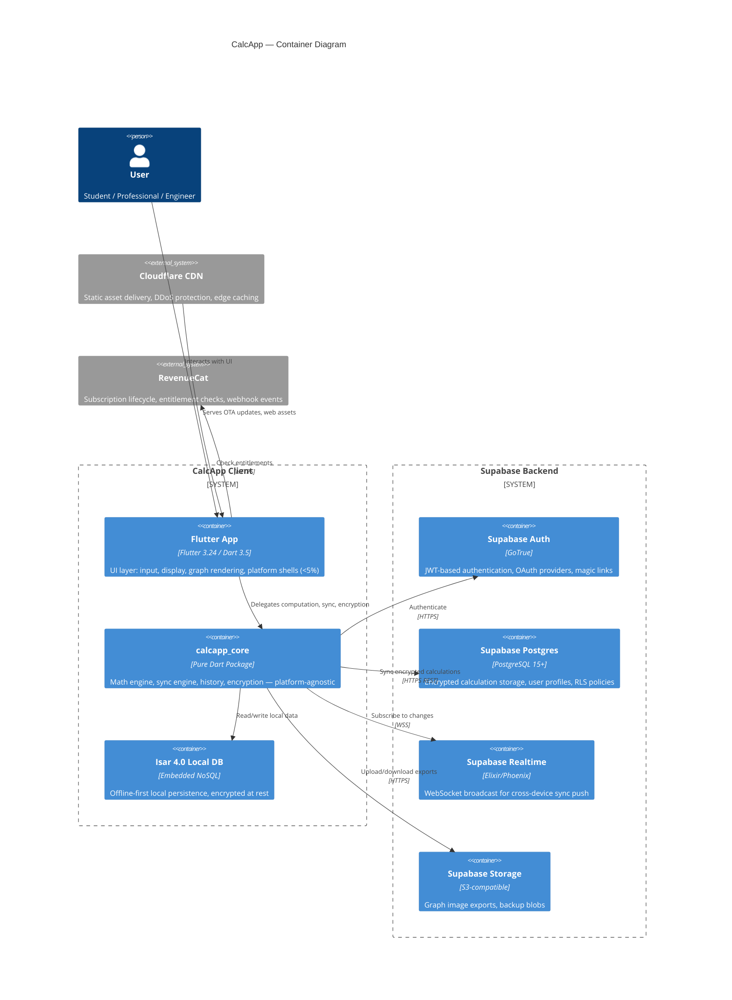
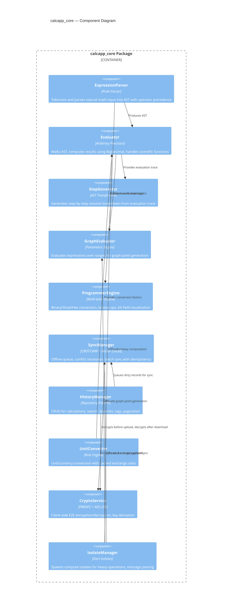
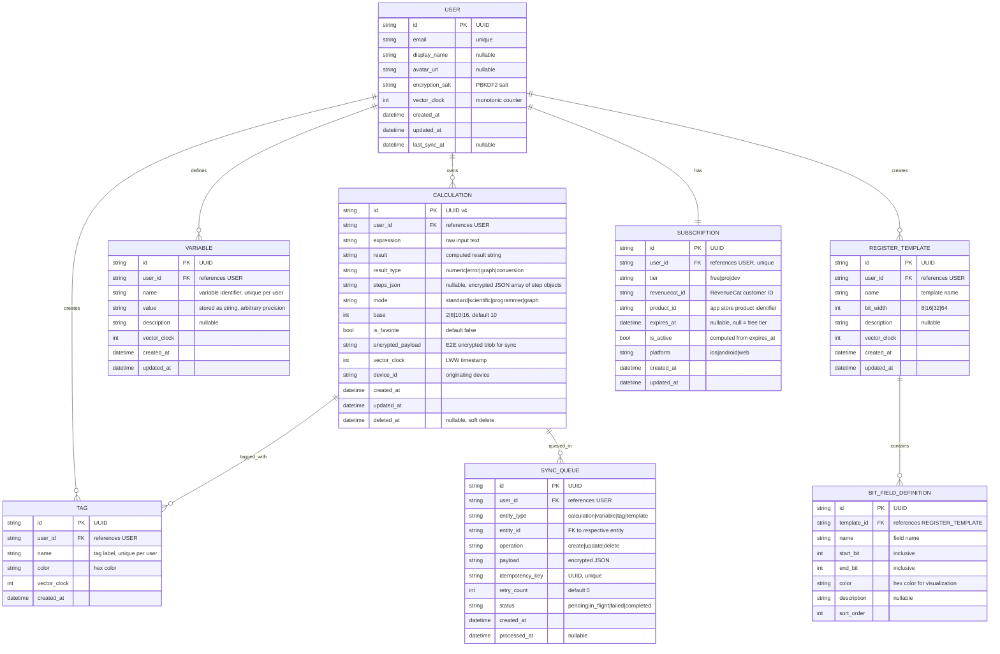
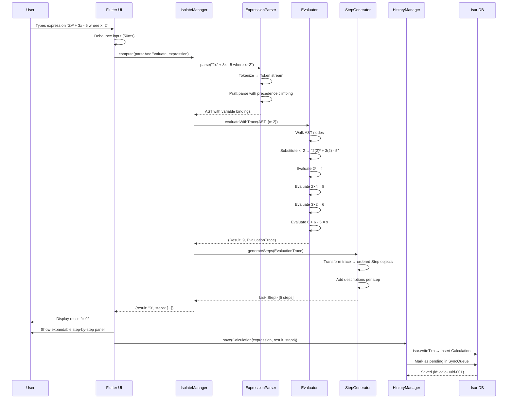
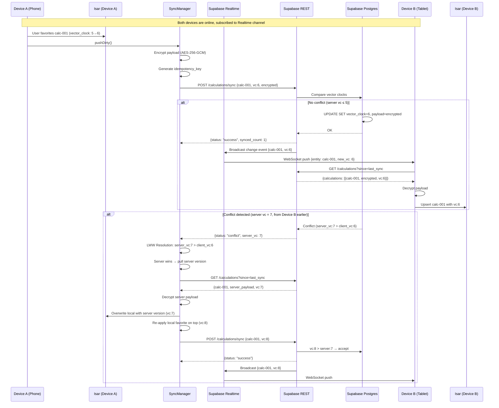
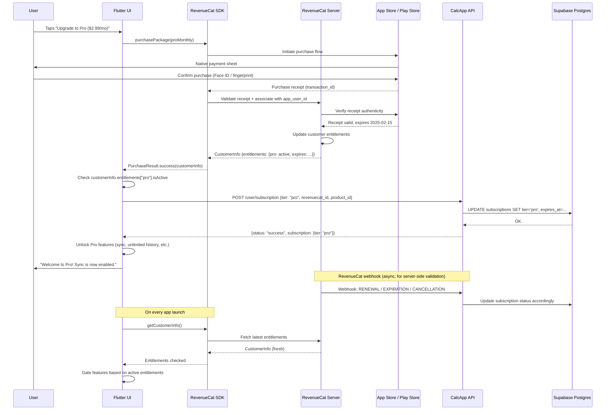
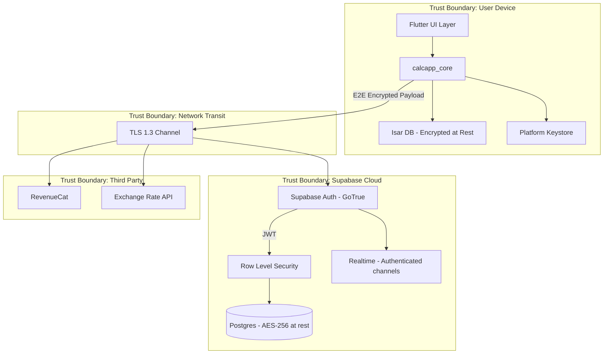
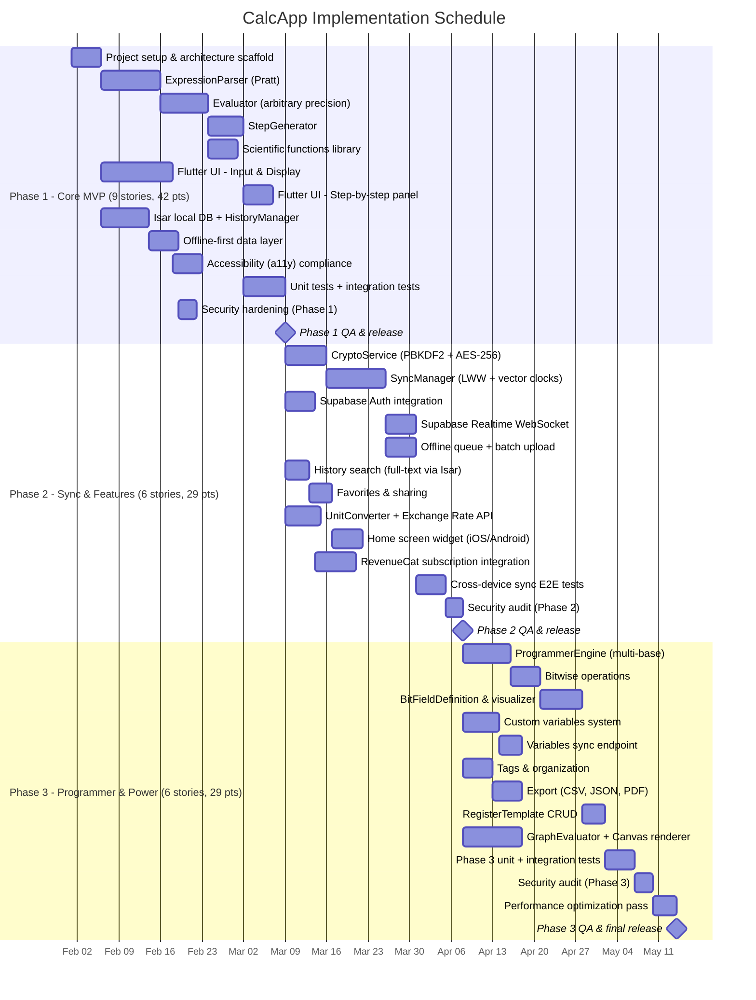

# CalcApp — System Design Document

**Version:** 1.0  
**Role:** Architect  
**Phase:** DESIGN (Mode 1 Full Army Pipeline)  
**Date:** 2025-01-XX  
**Status:** Draft

---

## Table of Contents

1. [System Context Diagram (C4 Level 1)](#1-system-context-diagram-c4-level-1)
2. [Container Diagram (C4 Level 2)](#2-container-diagram-c4-level-2)
3. [Component Architecture (C4 Level 3)](#3-component-architecture-c4-level-3---calcapp_core)
4. [Data Model](#4-data-model)
5. [API Contracts](#5-api-contracts)
6. [Architecture Decision Records](#6-architecture-decision-records-adrs)
7. [Sequence Diagrams](#7-sequence-diagrams)
8. [Capacity Planning](#8-capacity-planning)
9. [Security Architecture](#9-security-architecture)
10. [Gantt v1](#10-gantt-v1)

---

## 1. System Context Diagram (C4 Level 1)



---

## 2. Container Diagram (C4 Level 2)



---

## 3. Component Architecture (C4 Level 3 — calcapp_core)



### Module Interface Summary

| Module | Public Interface | Depends On |
|--------|-----------------|------------|
| ExpressionParser | `parse(String) → AST` | — |
| Evaluator | `evaluate(AST) → Result`, `evaluateWithTrace(AST) → (Result, Trace)` | ExpressionParser |
| StepGenerator | `generateSteps(Trace) → List<Step>` | Evaluator |
| GraphEvaluator | `evaluateRange(AST, Range, Resolution) → List<Point>` | Evaluator |
| ProgrammerEngine | `convert(value, fromBase, toBase)`, `bitwiseOp(a, b, op)`, `visualizeBitField(value, BitFieldDef)` | ExpressionParser |
| SyncManager | `pushDirty()`, `pullRemote()`, `resolveConflicts(local, remote) → Resolved` | CryptoService, HistoryManager |
| HistoryManager | `save(Calculation)`, `search(query)`, `getFavorites()`, `getByTag(tag)` | Isar DB (via repository) |
| UnitConverter | `convert(value, fromUnit, toUnit) → Result` | Exchange Rate cache |
| CryptoService | `encrypt(plaintext, key) → ciphertext`, `decrypt(ciphertext, key) → plaintext`, `deriveKey(password, salt) → Key` | — |
| IsolateManager | `compute<T>(Function, args) → Future<T>` | — |

---

## 4. Data Model

### Entity Relationship Diagram



### Isar Local Schema Notes

- All entities stored locally in Isar 4.0 with embedded indexes
- `SYNC_QUEUE` is local-only (never synced to server)
- `encrypted_payload` in Calculation stores the server-sync blob
- `steps_json` stored decrypted locally, encrypted in payload for sync
- Composite indexes: `(user_id, created_at)`, `(user_id, is_favorite)`, `(user_id, mode)`

---

## 5. API Contracts

**Base URL:** `https://api.calcapp.io/api/v1`  
**Authentication:** Bearer token (Supabase JWT) in `Authorization` header  
**Content-Type:** `application/json`  
**Rate Limiting:** 100 req/min per user (Free), 500 req/min (Pro/Dev)

---

### 5.1 POST /api/v1/calculations/sync

**Description:** Batch upload calculations with conflict resolution via vector clocks.

**Headers:**
| Header | Required | Description |
|--------|----------|-------------|
| Authorization | Yes | `Bearer <JWT>` |
| Idempotency-Key | Yes | UUID v4, unique per batch |
| Content-Type | Yes | `application/json` |

**Request Body:**
```json
{
  "idempotency_key": "550e8400-e29b-41d4-a716-446655440000",
  "device_id": "device-uuid-123",
  "calculations": [
    {
      "id": "calc-uuid-001",
      "expression": "2+2*3",
      "result": "8",
      "result_type": "numeric",
      "mode": "standard",
      "base": 10,
      "is_favorite": false,
      "encrypted_payload": "base64-encoded-encrypted-blob",
      "vector_clock": 5,
      "created_at": "2025-01-15T10:30:00Z",
      "updated_at": "2025-01-15T10:30:00Z",
      "deleted_at": null
    }
  ]
}
```

**Response (200 OK):**
```json
{
  "status": "success",
  "data": {
    "synced_count": 1,
    "conflict_count": 0,
    "conflicts": [],
    "server_vector_clock": 42
  },
  "metadata": {
    "idempotency_key": "550e8400-e29b-41d4-a716-446655440000",
    "processed_at": "2025-01-15T10:30:01Z"
  }
}
```

**Response (409 Conflict):**
```json
{
  "status": "conflict",
  "data": {
    "synced_count": 0,
    "conflict_count": 1,
    "conflicts": [
      {
        "id": "calc-uuid-001",
        "client_vector_clock": 5,
        "server_vector_clock": 7,
        "server_updated_at": "2025-01-15T10:29:55Z",
        "resolution": "server_wins"
      }
    ],
    "server_vector_clock": 42
  },
  "metadata": {
    "idempotency_key": "550e8400-e29b-41d4-a716-446655440000",
    "processed_at": "2025-01-15T10:30:01Z"
  }
}
```

**Status Codes:**
| Code | Description |
|------|-------------|
| 200 | Batch synced successfully |
| 207 | Partial success (some conflicts) |
| 409 | All items conflicted |
| 401 | Invalid or expired JWT |
| 413 | Batch too large (max 100 items) |
| 422 | Validation error |
| 429 | Rate limit exceeded |

---

### 5.2 GET /api/v1/calculations

**Description:** Paginated fetch of user's calculations with optional filters.

**Headers:**
| Header | Required | Description |
|--------|----------|-------------|
| Authorization | Yes | `Bearer <JWT>` |

**Query Parameters:**
| Param | Type | Default | Description |
|-------|------|---------|-------------|
| page | int | 1 | Page number (1-indexed) |
| per_page | int | 50 | Items per page (max 100) |
| since | ISO8601 | null | Only records updated after this timestamp |
| mode | string | null | Filter by mode (standard\|scientific\|programmer\|graph) |
| is_favorite | bool | null | Filter favorites only |
| search | string | null | Full-text search on expression/result |
| include_deleted | bool | false | Include soft-deleted records |

**Response (200 OK):**
```json
{
  "status": "success",
  "data": {
    "calculations": [
      {
        "id": "calc-uuid-001",
        "encrypted_payload": "base64-encoded-encrypted-blob",
        "vector_clock": 7,
        "mode": "standard",
        "is_favorite": false,
        "created_at": "2025-01-15T10:30:00Z",
        "updated_at": "2025-01-15T10:30:01Z",
        "deleted_at": null
      }
    ]
  },
  "pagination": {
    "page": 1,
    "per_page": 50,
    "total_items": 342,
    "total_pages": 7,
    "has_next": true
  },
  "metadata": {
    "server_vector_clock": 42,
    "fetched_at": "2025-01-15T10:31:00Z"
  }
}
```

**Status Codes:**
| Code | Description |
|------|-------------|
| 200 | Success |
| 401 | Invalid or expired JWT |
| 422 | Invalid query parameters |
| 429 | Rate limit exceeded |

---

### 5.3 DELETE /api/v1/calculations/{id}

**Description:** Soft-delete a specific calculation (sets `deleted_at` timestamp).

**Headers:**
| Header | Required | Description |
|--------|----------|-------------|
| Authorization | Yes | `Bearer <JWT>` |
| Idempotency-Key | Yes | UUID v4 |

**Path Parameters:**
| Param | Type | Description |
|-------|------|-------------|
| id | UUID | Calculation ID |

**Response (200 OK):**
```json
{
  "status": "success",
  "data": {
    "id": "calc-uuid-001",
    "deleted_at": "2025-01-15T11:00:00Z",
    "vector_clock": 8
  },
  "metadata": {
    "idempotency_key": "660e8400-e29b-41d4-a716-446655440001",
    "processed_at": "2025-01-15T11:00:01Z"
  }
}
```

**Status Codes:**
| Code | Description |
|------|-------------|
| 200 | Successfully soft-deleted |
| 401 | Invalid or expired JWT |
| 404 | Calculation not found or not owned by user |
| 429 | Rate limit exceeded |

---

### 5.4 POST /api/v1/variables/sync

**Description:** Batch sync user-defined variables (custom constants, stored values).

**Headers:**
| Header | Required | Description |
|--------|----------|-------------|
| Authorization | Yes | `Bearer <JWT>` |
| Idempotency-Key | Yes | UUID v4 |
| Content-Type | Yes | `application/json` |

**Request Body:**
```json
{
  "idempotency_key": "770e8400-e29b-41d4-a716-446655440002",
  "device_id": "device-uuid-123",
  "variables": [
    {
      "id": "var-uuid-001",
      "name": "tax_rate",
      "value": "0.0825",
      "description": "Texas sales tax",
      "vector_clock": 3,
      "updated_at": "2025-01-15T10:30:00Z"
    }
  ]
}
```

**Response (200 OK):**
```json
{
  "status": "success",
  "data": {
    "synced_count": 1,
    "conflict_count": 0,
    "conflicts": [],
    "server_vector_clock": 15
  },
  "metadata": {
    "idempotency_key": "770e8400-e29b-41d4-a716-446655440002",
    "processed_at": "2025-01-15T10:30:01Z"
  }
}
```

**Status Codes:**
| Code | Description |
|------|-------------|
| 200 | All variables synced |
| 207 | Partial success |
| 401 | Invalid or expired JWT |
| 413 | Batch too large (max 50 variables) |
| 422 | Validation error (duplicate names, invalid values) |
| 429 | Rate limit exceeded |

---

### 5.5 GET /api/v1/user/profile

**Description:** Retrieve current user profile, subscription status, and sync metadata.

**Headers:**
| Header | Required | Description |
|--------|----------|-------------|
| Authorization | Yes | `Bearer <JWT>` |

**Response (200 OK):**
```json
{
  "status": "success",
  "data": {
    "user": {
      "id": "user-uuid-001",
      "email": "user@example.com",
      "display_name": "Alex",
      "avatar_url": null,
      "created_at": "2025-01-01T00:00:00Z"
    },
    "subscription": {
      "tier": "pro",
      "product_id": "com.calcapp.pro.monthly",
      "expires_at": "2025-02-01T00:00:00Z",
      "is_active": true,
      "platform": "ios"
    },
    "sync_metadata": {
      "last_sync_at": "2025-01-15T10:30:00Z",
      "vector_clock": 42,
      "device_count": 2,
      "calculation_count": 342,
      "variable_count": 8
    }
  },
  "metadata": {
    "fetched_at": "2025-01-15T10:31:00Z"
  }
}
```

**Status Codes:**
| Code | Description |
|------|-------------|
| 200 | Success |
| 401 | Invalid or expired JWT |
| 429 | Rate limit exceeded |

---

### 5.6 POST /api/v1/user/delete-data

**Description:** GDPR-compliant full data deletion. Irrecoverable. Removes all user calculations, variables, templates, and profile data.

**Headers:**
| Header | Required | Description |
|--------|----------|-------------|
| Authorization | Yes | `Bearer <JWT>` |
| Idempotency-Key | Yes | UUID v4 |
| Content-Type | Yes | `application/json` |

**Request Body:**
```json
{
  "confirmation": "DELETE_ALL_MY_DATA",
  "reason": "no_longer_needed"
}
```

**Response (200 OK):**
```json
{
  "status": "success",
  "data": {
    "deleted_entities": {
      "calculations": 342,
      "variables": 8,
      "templates": 2,
      "tags": 5
    },
    "account_status": "scheduled_for_deletion",
    "deletion_completes_at": "2025-01-22T10:30:00Z"
  },
  "metadata": {
    "idempotency_key": "880e8400-e29b-41d4-a716-446655440003",
    "processed_at": "2025-01-15T10:30:01Z"
  }
}
```

**Status Codes:**
| Code | Description |
|------|-------------|
| 200 | Deletion scheduled |
| 400 | Missing or incorrect confirmation string |
| 401 | Invalid or expired JWT |
| 429 | Rate limit exceeded |

---

## 6. Architecture Decision Records (ADRs)

### ADR-007: Pratt Parser for Expression Parsing

**Status:** Accepted  
**Date:** 2025-01-15

**Context:**  
CalcApp requires parsing complex mathematical expressions with correct operator precedence, implicit multiplication (e.g., `2π`), nested functions (`sin(cos(x))`), and multiple number bases. The parser must execute in <50ms P95 on mobile devices and produce an AST suitable for both evaluation and step-by-step generation.

**Decision:**  
Use a Pratt parser (top-down operator precedence) implemented in pure Dart.

**Alternatives Considered:**

| Alternative | Rejection Rationale |
|-------------|-------------------|
| Recursive descent | Requires explicit precedence encoding per grammar rule, leading to deep call stacks for complex expressions. Adding new operators requires modifying multiple production rules. O(n²) worst case for deeply nested left-recursive grammars. |
| Parser combinators (petitparser) | Runtime overhead from closure allocations and backtracking. 3-5x slower than hand-written Pratt in benchmarks. Difficult to produce meaningful error messages with position information. |
| ANTLR / code generation | Adds build-time dependency, generated Dart code is verbose (~10K LOC for math grammar), runtime startup cost for grammar initialization exceeds cold-start budget. |
| Shunting-yard algorithm | Produces postfix output suitable for stack evaluation but not for AST construction needed by StepGenerator. Extending for functions and implicit multiplication requires significant modifications that approach Pratt complexity. |

**Consequences:**
- (+) O(n) parsing with predictable performance on mobile
- (+) Trivial to add new operators/functions by registering precedence + handler
- (+) Produces rich AST with position info for error reporting and step generation
- (+) No external dependencies, pure Dart, runs in isolates
- (-) More upfront design work than using a parser library
- (-) Team must understand precedence climbing pattern

---

### ADR-008: LWW with Vector Clocks for Sync Conflict Resolution

**Status:** Accepted  
**Date:** 2025-01-15

**Context:**  
CalcApp supports offline-first with cross-device sync. Users may edit favorites, create calculations, or delete entries on multiple devices while offline. Conflicts arise when the same entity is modified on two devices before sync. The resolution strategy must be deterministic, require no server-side merge logic, and handle the common case (last edit wins) correctly.

**Decision:**  
Use Last-Writer-Wins (LWW) registers with per-device vector clocks. Each entity carries a vector clock incremented on mutation. On sync, the server compares vector clocks; the highest clock wins. Ties broken by device_id lexicographic order (deterministic).

**Alternatives Considered:**

| Alternative | Rejection Rationale |
|-------------|-------------------|
| Operational Transformation (OT) | Designed for collaborative text editing, massive overkill for discrete calculation records. Requires server-side transformation functions, increases backend complexity. No concurrent editing of the same calculation expected. |
| CRDTs (G-Counter, OR-Set) | Full CRDT implementation requires embedding metadata in every field, increasing storage 3-5x per record. OR-Set tombstone accumulation requires garbage collection strategy. Complexity unjustified for records that are written once and rarely updated. |
| Manual conflict resolution (user picks) | Poor UX — users don't want to resolve calculator history conflicts. Requires UI for conflict display, increases cognitive load. Acceptable as fallback for edge cases but not primary strategy. |
| Server-authoritative (last-to-server wins) | Penalizes users with poor connectivity. A device syncing after 2 days offline would lose all changes to a device that synced 1 hour ago. Violates offline-first principle. |

**Consequences:**
- (+) Simple implementation: compare clocks, highest wins
- (+) No server merge logic — stateless sync endpoint
- (+) Deterministic: same inputs always produce same resolution
- (+) Low metadata overhead: single integer per entity per device
- (-) May lose edits in true simultaneous conflicting writes (rare for calculator)
- (-) Requires monotonic clock discipline on each device
- (-) Vector clock size grows linearly with device count (mitigated: max 5 devices per user)

---

### ADR-009: Isar over SQLite for Local Persistence

**Status:** Accepted  
**Date:** 2025-01-15

**Context:**  
CalcApp needs a local database for offline-first storage on iOS, Android, macOS, Windows, and Linux. Requirements: <5ms read latency for history list, support for full-text search on expressions, embedded (no separate process), and Dart-native API for ergonomic integration with calcapp_core.

**Decision:**  
Use Isar 4.0 as the local embedded database.

**Alternatives Considered:**

| Alternative | Rejection Rationale |
|-------------|-------------------|
| SQLite (via sqflite/drift) | Requires FFI bridge with platform-specific compilation. SQLite's relational model adds ORM overhead for document-like calculation records. Full-text search (FTS5) requires separate virtual tables and manual index management. No native Dart query builder without drift (which adds code generation step). |
| Hive | No support for complex queries (search, filter by mode, sort by date). No built-in full-text search. Schema migrations are manual and error-prone. Abandoned in favor of Isar by same author. |
| ObjectBox | Dart support is secondary to Java/Kotlin/Swift. Smaller Flutter community, fewer resources. License restrictions for commercial use. Platform support gaps on desktop Linux. |
| Shared Preferences + JSON files | No indexing, O(n) search on history. Corruption risk with concurrent writes. No transactional guarantees. Unusable beyond 1000 records. |

**Consequences:**
- (+) Native Dart API with generated query builders — zero impedance mismatch
- (+) Built-in full-text search with configurable tokenizers
- (+) ACID transactions for sync queue consistency
- (+) Cross-platform: iOS, Android, macOS, Windows, Linux from single codebase
- (+) Async I/O with isolate-safe access patterns
- (-) Newer than SQLite — smaller ecosystem, fewer Stack Overflow answers
- (-) Schema migrations require careful version management
- (-) Binary size adds ~2MB to APK (within 15MB budget)

---

### ADR-010: Isolate-Based Computation for Non-Blocking UI

**Status:** Accepted  
**Date:** 2025-01-15

**Context:**  
CalcApp must maintain P95 <50ms keypress-to-render latency. Complex operations — arbitrary precision arithmetic on large numbers, graph evaluation over 1000+ points, batch encryption for sync, and step generation for complex expressions — can exceed 16ms (one frame at 60fps), causing jank. Dart is single-threaded per isolate; blocking the main isolate blocks the UI.

**Decision:**  
Use Dart isolates via `Isolate.spawn` and `compute()` for all operations exceeding estimated 5ms execution time. Maintain a pool of 2-4 warm isolates for rapid dispatch. Communication via `SendPort`/`ReceivePort` with serializable message objects.

**Alternatives Considered:**

| Alternative | Rejection Rationale |
|-------------|-------------------|
| Main isolate with microtask chunking | Requires manual yield points (`await Future.delayed(Duration.zero)`) sprinkled throughout computation code. Pollutes business logic with scheduling concerns. Unreliable latency — chunk boundaries are estimates. Cannot guarantee frame deadlines. |
| Platform channels to native threads | Breaks pure-Dart architecture constraint. Each platform (iOS/Android/desktop) needs separate native implementation. Doubles testing surface. Violates <5% platform shell rule. |
| Web Workers (Flutter web only) | Not cross-platform. Only solves web target. Different API from native isolates. Would require separate computation strategy per platform. |
| `compute()` only (no isolate pool) | Cold isolate spawn takes 50-200ms. Acceptable for one-off heavy tasks but unacceptable for rapid successive calculations (user typing fast). Pool amortizes spawn cost. |

**Consequences:**
- (+) UI thread never blocked — guaranteed 60fps rendering
- (+) Pure Dart — same code runs on all platforms
- (+) Pool of warm isolates eliminates spawn latency for rapid calculations
- (+) Clean separation: computation modules are isolate-agnostic (just functions)
- (-) Serialization overhead for large ASTs crossing isolate boundary (~0.5ms for typical expression)
- (-) Debugging across isolates is harder (no shared memory inspection)
- (-) Memory overhead: each isolate has its own heap (~5-10MB per idle isolate)
- (-) Must design all shared state as message-passing (no shared mutable state)

---

### ADR-011: PBKDF2 Client-Side Encryption for Zero-Knowledge Sync

**Status:** Accepted  
**Date:** 2025-01-15

**Context:**  
CalcApp syncs calculation data to Supabase for cross-device access. Users expect privacy — the server should never see plaintext calculations. The encryption scheme must: derive a key from user password (no separate key management), work offline (no HSM/KMS dependency), be fast enough for batch operations, and be implementable in pure Dart for cross-platform support.

**Decision:**  
Use PBKDF2 (100,000 iterations, SHA-256) to derive a 256-bit encryption key from user password + per-user salt. Encrypt calculation payloads with AES-256-GCM before upload. Server stores only ciphertext. Key never leaves the device. Salt stored server-side (not secret, prevents rainbow tables).

**Alternatives Considered:**

| Alternative | Rejection Rationale |
|-------------|-------------------|
| Argon2id key derivation | Superior memory-hard KDF, but no mature pure-Dart implementation. Native FFI required — breaks cross-platform pure-Dart constraint. Argon2 tuning (memory, parallelism) varies by device capability, complicating consistent behavior across low-end phones and desktops. |
| Server-side encryption (Supabase Vault) | Violates zero-knowledge requirement. Supabase/server admin could access plaintext. User must trust infrastructure operator. Does not protect against server-side breaches. |
| Hardware-backed keystore (iOS Keychain / Android Keystore) | Platform-specific. Cannot share key across platforms for cross-device sync. User switching from iOS to Android loses access to encrypted data. Requires platform channel code violating <5% shell rule. |
| No encryption (TLS only) | Only protects data in transit. At-rest data on server is plaintext. Supabase breach exposes all user calculations. Unacceptable for privacy-conscious users (engineers with proprietary calculations). |

**Consequences:**
- (+) Zero-knowledge: server never sees plaintext, even with full DB access
- (+) Pure Dart implementation — cross-platform, no native dependencies
- (+) Standard algorithm — well-audited, NIST-approved
- (+) Key derived from password — no separate key backup/recovery needed
- (+) AES-256-GCM provides authenticated encryption (integrity + confidentiality)
- (-) 100K PBKDF2 iterations adds ~200ms on first unlock (acceptable at app start, cached thereafter)
- (-) Password change requires re-encrypting all data (batch operation, can be background)
- (-) Lost password = lost data (no recovery possible — acceptable tradeoff for zero-knowledge)
- (-) PBKDF2 is less memory-hard than Argon2 (mitigated by high iteration count)

---

## 7. Sequence Diagrams

### 7.1 Calculation with Step-by-Step Generation



---

### 7.2 Cross-Device Sync with Conflict Resolution



---

### 7.3 Subscription Verification (RevenueCat → App Entitlement)



---

## 8. Capacity Planning

### Scale Projections by Phase

| Metric | Phase 1 (MVP) | Phase 2 (Growth) | Phase 3 (Scale) |
|--------|---------------|-------------------|------------------|
| **MAU** | 5,000 | 50,000 | 250,000 |
| **DAU** | 1,500 | 15,000 | 75,000 |
| **Peak Concurrent** | 150 | 1,500 | 7,500 |
| **Peak RPS (API)** | 25 | 250 | 1,200 |
| **Peak RPS (Realtime WS)** | 10 | 100 | 500 |
| **Calculations/day** | 15,000 | 150,000 | 750,000 |
| **Avg payload size** | 2 KB | 2 KB | 2 KB |
| **Daily ingestion** | 30 MB | 300 MB | 1.5 GB |
| **DB Storage (cumulative)** | 5 GB | 50 GB | 250 GB |
| **Realtime connections (peak)** | 100 | 1,000 | 5,000 |
| **Bandwidth/month** | 50 GB | 500 GB | 2.5 TB |

### Compute Resources by Phase

| Resource | Phase 1 | Phase 2 | Phase 3 |
|----------|---------|---------|---------|
| **Supabase Plan** | Pro ($25/mo) | Pro ($25/mo) + read replicas | Enterprise (custom) |
| **Postgres** | 2 vCPU, 4GB RAM | 4 vCPU, 8GB RAM + 1 replica | 8 vCPU, 32GB RAM + 2 replicas |
| **Realtime** | Included (500 connections) | Included (5,000 connections) | Dedicated cluster |
| **CDN (Cloudflare)** | Free tier | Pro ($20/mo) | Business ($200/mo) |
| **RevenueCat** | Free (<$2.5K MTR) | Starter ($99/mo) | Scale ($499/mo) |
| **Monitoring** | Supabase dashboard | Supabase + Sentry ($29/mo) | Datadog ($150/mo) |
| **Estimated Monthly Cost** | $75 | $400 | $2,500 |
| **Cost per MAU** | $0.015 | $0.008 | $0.010 |

### Performance Budgets

| Metric | Target | Measurement |
|--------|--------|-------------|
| Keypress-to-render P95 | <50ms | Flutter DevTools timeline |
| Cold start (Android) | <2s | adb shell am start timing |
| Cold start (iOS) | <1.5s | Instruments Time Profiler |
| Sync round-trip P95 | <500ms | API latency monitoring |
| APK size | <15 MB | `flutter build apk --release` |
| iOS bundle size | <25 MB | App Store Connect |
| Memory (idle) | <80 MB | Flutter Observatory |
| Memory (heavy computation) | <150 MB | Isolate memory tracking |
| Battery drain (background sync) | <2%/hr | Platform battery profiler |
| Sync uptime | 99.9% | Supabase status + custom probe |

---

## 9. Security Architecture

### 9.1 Trust Boundaries



### 9.2 Authentication Flow

```
1. User signs up → Supabase Auth (email/password or OAuth)
2. Auth issues JWT (access_token, 1hr expiry + refresh_token, 7d)
3. JWT contains: sub (user_id), role, exp, app_metadata
4. All API calls carry Authorization: Bearer <access_token>
5. Supabase Postgres RLS policies enforce: auth.uid() = user_id
6. Token refresh handled automatically by Supabase client SDK
7. Logout → revoke refresh token server-side, clear local tokens
```

### 9.3 Encryption Layers

| Layer | Mechanism | Protects Against |
|-------|-----------|-----------------|
| **Transit** | TLS 1.3 (certificate pinning on mobile) | MITM, eavesdropping |
| **Server at-rest** | AES-256 (Supabase managed, transparent) | Physical disk theft, backup leaks |
| **Client E2E** | AES-256-GCM with PBKDF2-derived key | Server breach, admin access, legal compulsion |
| **Local at-rest** | Isar encryption (platform keystore key) | Device theft, forensic extraction |
| **Key derivation** | PBKDF2-SHA256, 100K iterations, 32-byte salt | Brute force, rainbow tables |

### 9.4 Data Classification

| Classification | Examples | Storage | Encryption | Retention |
|---------------|----------|---------|------------|-----------|
| **PII - High** | Email, password hash, OAuth tokens | Auth DB only | Server-managed, never in app DB | Until account deletion |
| **PII - Medium** | Display name, avatar URL | Postgres + local | E2E encrypted in sync payload | Until account deletion |
| **User Content** | Calculations, expressions, results, steps | Postgres + local | E2E encrypted (zero-knowledge) | User-controlled, GDPR delete |
| **User Config** | Variables, templates, tags, favorites | Postgres + local | E2E encrypted | User-controlled |
| **Metadata - Low** | Sync timestamps, vector clocks, device IDs | Postgres + local | Server at-rest only (needed for sync logic) | Auto-purge after 90 days inactive |
| **Subscription** | Tier, expiry, RevenueCat ID | Postgres | Server at-rest | Until account deletion |
| **Analytics** | Feature usage counts (no PII) | Aggregated only | N/A | 12 months rolling |

### 9.5 Security Controls

| Control | Implementation |
|---------|---------------|
| Input validation | Expression length limit (10K chars), sanitized before parse |
| Rate limiting | Per-user: 100 req/min (Free), 500 (Pro/Dev). Per-IP: 1000/min |
| Certificate pinning | iOS: TrustKit, Android: OkHttp CertificatePinner |
| Secrets management | Platform keystore (Keychain/Keystore) for encryption keys |
| Dependency security | `dart pub outdated`, automated Dependabot alerts |
| Code obfuscation | `--obfuscate --split-debug-info` on release builds |
| Jailbreak/root detection | Warn user, allow usage (no blocking) |
| SQL injection | Supabase RLS + parameterized queries (PostgREST) |
| CORS | API restricted to app bundle IDs, no wildcard origins |
| Audit logging | Auth events, data deletion events logged server-side |

---

## 10. Gantt v1



### Role Assignments

| Stream | Primary Role | Supporting Role |
|--------|-------------|-----------------|
| Math Engine (Parser, Evaluator, Steps) | Senior Dart Engineer | Architect (design review) |
| Flutter UI & Accessibility | Flutter Engineer | UX Designer (specs) |
| Sync Engine & Crypto | Backend/Infra Engineer | Security Engineer (review) |
| Supabase Backend & APIs | Backend Engineer | DBA (schema review) |
| DevOps & CI/CD | DevOps Engineer | SRE (monitoring) |
| Testing | QA Engineer | All engineers (unit tests) |
| Subscriptions & IAP | Mobile Engineer | Product Manager (pricing) |

### Phase Dependencies

```
Phase 1 → Phase 2: Local DB schema must be stable before sync layer builds on it
Phase 2 → Phase 3: Sync infrastructure must exist before programmer mode syncs variables/templates
Cross-cutting: Security reviews gate each phase release
Cross-cutting: CI/CD pipeline established in Phase 1, extended each phase
```

---

## Appendix: Technology Stack Summary

| Layer | Technology | Version | Purpose |
|-------|-----------|---------|---------|
| UI Framework | Flutter | 3.24 | Cross-platform rendering |
| Language | Dart | 3.5 | Application logic |
| Local DB | Isar | 4.0 | Offline-first persistence |
| Backend DB | PostgreSQL | 15+ | Server-side storage (via Supabase) |
| Auth | Supabase Auth (GoTrue) | Latest | JWT-based authentication |
| Realtime | Supabase Realtime | Latest | WebSocket sync notifications |
| Subscriptions | RevenueCat | Latest | Cross-platform IAP management |
| CDN | Cloudflare | — | Asset delivery, DDoS protection |
| Encryption | AES-256-GCM + PBKDF2 | — | Client-side E2E encryption |
| CI/CD | GitHub Actions | — | Build, test, deploy pipelines |
| Monitoring | Sentry + Supabase Dashboard | — | Error tracking, performance |

---

*End of System Design Document*
